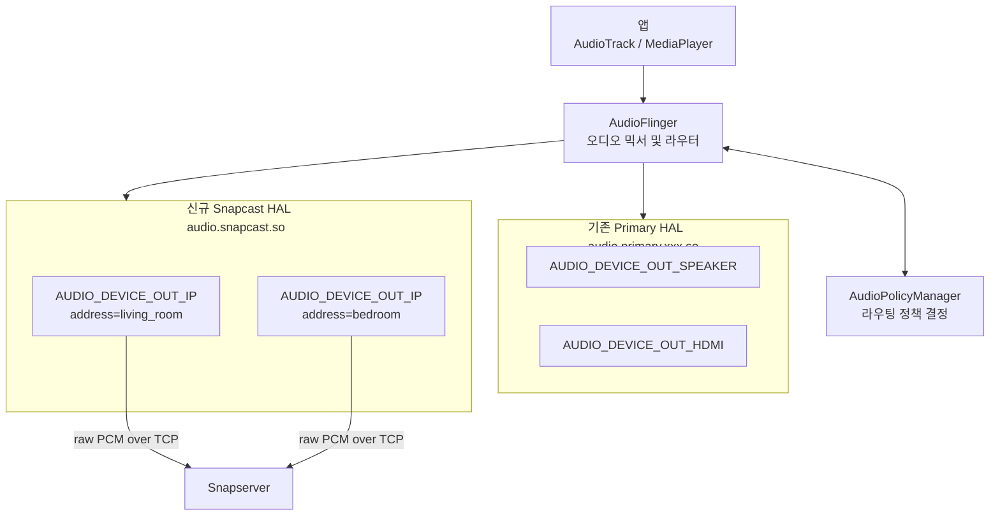
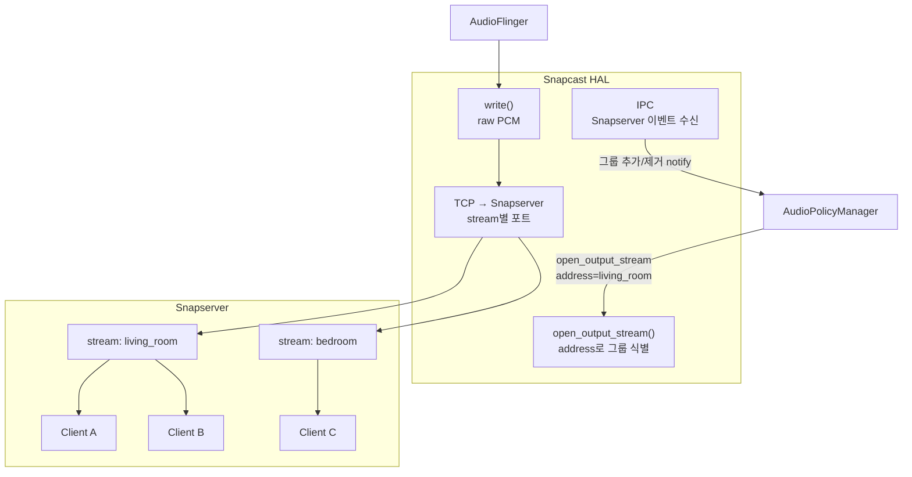

# Android Audio HAL 통합 검토

## 목표

기존 Primary HAL을 유지하면서 Snapcast 전용 신규 HAL 모듈을 추가한다.
클라이언트 장치가 추가될 때 `AUDIO_DEVICE_OUT_IP` 타입 디바이스를 동적으로 등록하고, `address` 필드로 개별 클라이언트를 구분하는 방안을 검토한다.

---

## Android 오디오 스택 구조



---

## 검토 결과

### 긍정적 평가

- **`AUDIO_DEVICE_OUT_IP` 선택 적합** — Android에 이미 정의된 네트워크 오디오 출력 타입이며, `(device_type, address)` 쌍으로 디바이스를 구분하는 방식이 APM 표준 동작과 일치한다.
- **Primary HAL 유지 + 신규 HAL 추가 구조 가능** — `audio_policy_configuration.xml` 에서 모듈을 분리하면 독립적으로 동작한다.

---

### 문제점 1: 클라이언트 단위 vs 스트림/그룹 단위 불일치 (핵심)

Snapcast는 서버가 동일 스트림을 여러 클라이언트에 배포하는 구조다.
클라이언트 1개 = HAL 디바이스 1개로 매핑하면 AudioFlinger는 디바이스마다 독립 MixPort(출력 스트림)를 열려고 한다.
같은 그룹의 클라이언트가 동일한 오디오를 받아야 하는데 HAL이 PCM을 클라이언트 수만큼 중복 수신하게 되어 낭비 및 동기화 오차가 발생한다.

**권장**: 디바이스 단위를 **클라이언트**가 아닌 **Snapcast 그룹/스트림** 으로 설정한다.

```
AUDIO_DEVICE_OUT_IP + address="living_room" → Snapserver stream "living_room" → 클라이언트 N개
AUDIO_DEVICE_OUT_IP + address="bedroom"     → Snapserver stream "bedroom"     → 클라이언트 M개
```



---

### 문제점 2: address 식별자로 IP 사용 시 문제

| 문제 | 내용 |
|------|------|
| DHCP 변경 | 클라이언트 IP가 바뀌면 동일 기기 구분 불가 |
| 중복 가능 | 동일 IP에서 복수 Snapclient 인스턴스 실행 가능 |

**권장**: Snapcast 내부 `host_id` (MAC 주소 기반, `hello.hpp`) 를 address로 사용한다.

```
address = "snapcast:<host_id>"    예: "snapcast:aa:bb:cc:dd:ee:ff"
```

---

### 문제점 3: 동적 디바이스 등록 메커니즘

클라이언트(또는 그룹) 추가·제거 이벤트를 APM에 전달하는 방식이 Android 버전별로 다르다.

| Android 버전 | 방식 |
|---|---|
| ~11 (Legacy/HIDL) | `set_parameters("connect=AUDIO_DEVICE_OUT_IP\|address=xxx")` |
| 12+ (AIDL) | `IModule.connectedExternalDevice()` / `disconnectedExternalDevice()` |

또한 Snapserver(네이티브 프로세스)가 새 클라이언트 연결을 HAL에 알릴 IPC 채널 설계가 필요하다.

---

### 문제점 4: audio_policy_configuration.xml 설정

신규 HAL 모듈에서 동적 디바이스 등록이 동작하려면 `dynamic="true"` 가 필수다.

```xml
<!-- 기존 Primary HAL -->
<module name="primary" halVersion="2.0">
    <attachedDevices>
        <item>AUDIO_DEVICE_OUT_SPEAKER</item>
        <item>AUDIO_DEVICE_OUT_HDMI</item>
    </attachedDevices>
</module>

<!-- 신규 Snapcast HAL -->
<module name="snapcast" halVersion="2.0">
    <mixPorts>
        <mixPort name="snapcast output" role="source" maxActiveCount="8">
            <profile name="" format="AUDIO_FORMAT_PCM_16_BIT"
                     samplingRates="48000"
                     channelMasks="AUDIO_CHANNEL_OUT_STEREO"/>
        </mixPort>
    </mixPorts>
    <devicePorts>
        <devicePort tagName="Snapcast Out" type="AUDIO_DEVICE_OUT_IP"
                    role="sink" dynamic="true"/>
    </devicePorts>
    <routes>
        <route type="mix" sink="Snapcast Out" sources="snapcast output"/>
    </routes>
</module>
```

---

## HAL 구현 골격 (Legacy HAL 기준)

```c
// audio_snapcast.c

struct snapcast_stream_out {
    struct audio_stream_out stream;  // 반드시 첫 멤버
    int tcp_fd;                      // Snapserver TCP 소켓
    char group_address[64];          // 그룹 식별자 (address)
};

// AudioFlinger가 매 버퍼마다 호출
static ssize_t out_write(struct audio_stream_out *stream,
                         const void *buffer, size_t bytes)
{
    struct snapcast_stream_out *out = (struct snapcast_stream_out *)stream;
    return send(out->tcp_fd, buffer, bytes, MSG_NOSIGNAL);
}

static int adev_open_output_stream(struct audio_hw_device *dev,
                                   audio_io_handle_t handle,
                                   audio_devices_t devices,
                                   audio_output_flags_t flags,
                                   struct audio_config *config,
                                   struct audio_stream_out **stream_out,
                                   const char *address)  // 그룹명 또는 host_id
{
    struct snapcast_stream_out *out = calloc(1, sizeof(*out));
    strncpy(out->group_address, address, sizeof(out->group_address) - 1);

    // Snapserver의 해당 그룹 포트로 TCP 연결
    out->tcp_fd = connect_to_snapserver(address);

    out->stream.write = out_write;
    // ... 나머지 콜백 등록

    *stream_out = &out->stream;
    return 0;
}
```

---

## AOSP 빌드 통합

```
vendor/
└── mycompany/
    └── audio/
        ├── Android.bp
        ├── audio_snapcast.c
        └── audio_policy_configuration.xml
```

`Android.bp`:
```
cc_library_shared {
    name: "audio.snapcast",
    srcs: ["audio_snapcast.c"],
    shared_libs: ["liblog", "libcutils"],
    relative_install_path: "hw",
}
```

---

## 결론 및 다음 단계

| 항목 | 결정 |
|------|------|
| `AUDIO_DEVICE_OUT_IP` 사용 | 확정 |
| address 단위 | **클라이언트 IP → Snapcast 그룹/스트림명으로 변경** |
| address 식별자 | **IP → host_id (MAC 기반) 권장** |
| Primary HAL 분리 | `audio_policy_configuration.xml` 모듈 분리로 해결 |
| 동적 디바이스 등록 | `dynamic="true"` + Android 버전별 등록 API |
| HAL ↔ Snapserver IPC | 별도 설계 필요 (소켓 또는 binder) |

**다음 작업 후보**:
1. Snapcast 그룹/스트림 기반 HAL 디바이스 매핑 설계
2. HAL ↔ Snapserver IPC 채널 설계
3. Android 버전 결정 후 HIDL / AIDL HAL 인터페이스 구현
4. `tcp_stream`의 `mode=client` 를 그룹별 다중 포트로 확장하는 서버 측 수정 검토
