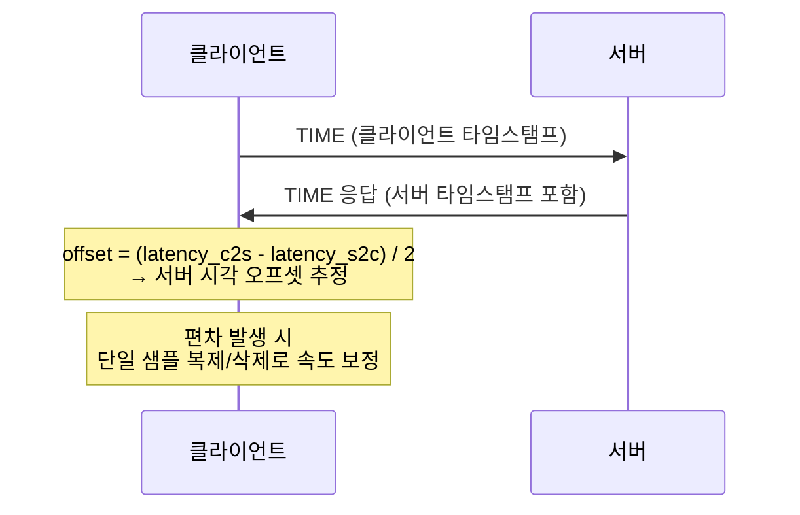
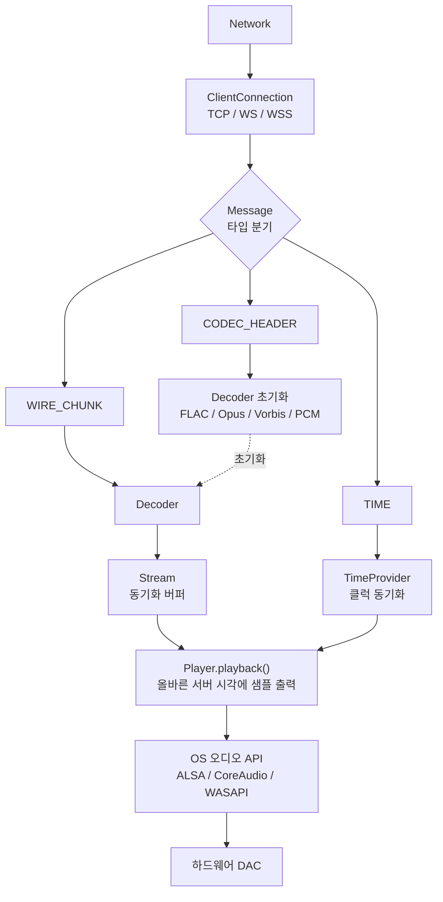

# Snapclient 분석

## 역할

서버에 TCP/WebSocket으로 연결하여 인코딩된 오디오를 수신하고, 서버 시각과 동기화하여 정확한 타이밍에 오디오를 재생한다.

---

## 코어 클라이언트 파일

| 파일 | 역할 |
|------|------|
| `snapclient.cpp` | 진입점 — CLI 파싱, 플레이어 및 연결 초기화 |
| `controller.cpp` | 핵심 제어 — 연결 생명주기, 시간 동기화, 볼륨 |
| `client_connection.hpp` | 서버 연결 추상화 |
| `client_settings.hpp` | 클라이언트 설정 구조체 |
| `stream.cpp` | 수신된 PCM 청크 버퍼링 및 동기화된 접근 제공 |
| `time_provider.cpp` | 서버-클라이언트 클럭 동기화 (NTP 방식) |
| `double_buffer.hpp` | 이중 버퍼 — 네트워크 지터로 인한 오디오 끊김 방지 |

---

## 연결 방식

`client_connection.hpp` 에 세 가지 구현체가 있다.

| 구현체 | 프로토콜 |
|--------|---------|
| `ClientConnectionTcp` | 일반 TCP |
| `ClientConnectionWs` | WebSocket |
| `ClientConnectionWss` | WebSocket + SSL/TLS |

---

## 시간 동기화 메커니즘

`time_provider.cpp` 와 `stream.cpp` 가 핵심이다.

전형적인 동기화 편차: **< 0.2ms**

리샘플링 라이브러리: **soxr** (`common/resampler.cpp`)

---

## 디코더 (`decoder/`)

서버 인코더에 1:1 대응한다. 모든 디코더는 `Decoder` 기반 클래스를 상속한다.

| 파일 | 코덱 |
|------|------|
| `flac_decoder.cpp` | FLAC 무손실 |
| `opus_decoder.cpp` | Opus 저지연 |
| `ogg_decoder.cpp` | Ogg/Vorbis |
| `pcm_decoder.cpp` | Raw PCM |
| `null_decoder.cpp` | 패스스루 (테스트) |

---

## 플레이어 (`player/`)

플랫폼별 오디오 출력 백엔드. 모두 `Player` 기반 클래스를 상속하며 팩토리 패턴으로 선택된다.

| 파일 | 플랫폼 | 백엔드 |
|------|--------|--------|
| `alsa_player.cpp` | Linux | ALSA |
| `pulse_player.cpp` | Linux | PulseAudio |
| `pipewire_player.cpp` | Linux | PipeWire |
| `coreaudio_player.cpp` | macOS | CoreAudio |
| `wasapi_player.cpp` | Windows | WASAPI |
| `oboe_player.cpp` | Android | Oboe |
| `opensl_player.cpp` | Android | OpenSL ES |
| `sdl2_player.cpp` | 크로스플랫폼 | SDL2 (webOS 등) |
| `file_player.cpp` | 범용 | 파일/stdout 출력 |

`pcm_device.hpp` 는 PCM 디바이스 추상화를 정의한다.

---

## 서비스 디스커버리 (`browseZeroConf/`)

mDNS를 통해 로컬 네트워크에서 Snapserver를 자동 탐색한다.

| 파일 | 플랫폼 |
|------|--------|
| `browse_avahi.cpp` | Linux (Avahi) |
| `browse_bonjour.cpp` | macOS (Bonjour) |

---

## 클라이언트 오디오 처리 흐름

