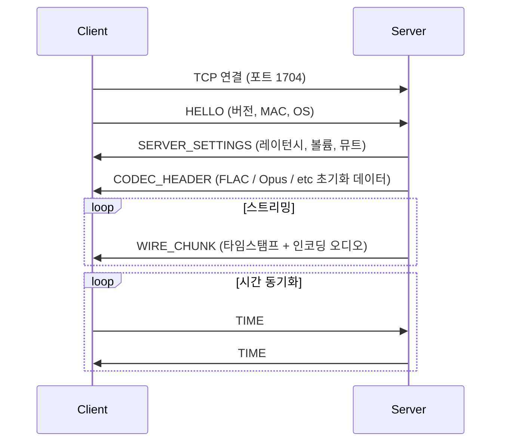
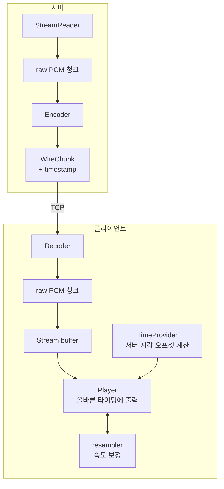

# 공유 라이브러리 및 바이너리 프로토콜 분석

## 역할

서버와 클라이언트 모두가 사용하는 공통 코드. 바이너리 프로토콜 메시지 정의, 오디오 처리 유틸리티, 의존성 헤더가 포함된다.

---

## 파일 구성

### 오디오 처리

| 파일 | 역할 |
|------|------|
| `sample_format.hpp/cpp` | 샘플레이트, 비트심도, 채널 수 추상화 |
| `resampler.hpp/cpp` | soxr 기반 오디오 리샘플러 (시간 편차 교정용) |

### 네트워크 / 스트림

| 파일 | 역할 |
|------|------|
| `stream_uri.hpp/cpp` | 스트림 URI 파서 (`pipe:///tmp/snapfifo?codec=flac`) |

### 시스템 유틸리티

| 파일 | 역할 |
|------|------|
| `daemon.hpp/cpp` | Unix 데몬화 지원 |
| `endian.hpp` | 리틀 엔디언 직렬화 헬퍼 |
| `time_defs.hpp` | 시간 타입 및 유틸리티 |
| `error_code.hpp` | 에러 코드 정의 |
| `snap_exception.hpp` | 커스텀 예외 클래스 |
| `queue.hpp` | 스레드 안전 큐 템플릿 |
| `str_compat.hpp` | 문자열 호환성 헬퍼 |
| `utils.hpp` | 범용 유틸리티 |
| `utils/` | 문자열, 파일 I/O 유틸리티 디렉토리 |

### 3rd-party 헤더 (헤더 전용)

| 파일 | 라이브러리 |
|------|-----------|
| `json.hpp` | nlohmann/json — JSON 파싱 및 직렬화 |
| `aixlog.hpp` | 로깅 프레임워크 |
| `popl.hpp` | 커맨드라인 파싱 |
| `base64.h/cpp` | Base64 인코딩 (인증용) |

---

## 바이너리 프로토콜 (`message/`)

서버-클라이언트 간 모든 통신은 이 디렉토리의 메시지로 정의된다. 리틀 엔디언 직렬화, 엔디언 독립적 와이어 포맷을 사용한다.

### 메시지 타입

| ID | 클래스 | 파일 | 방향 | 내용 |
|----|--------|------|------|------|
| 0 | Base | `message.hpp` | 공통 | 모든 메시지의 기반 헤더 (타입, 타임스탬프) |
| 1 | CodecHeader | `codec_header.hpp` | S→C | 코덱 초기화 데이터 (디코더 초기화에 필요) |
| 2 | WireChunk | `wire_chunk.hpp` | S→C | 인코딩된 오디오 청크 + 서버 타임스탬프 |
| 3 | ServerSettings | `server_settings.hpp` | S→C | 레이턴시, 볼륨, 뮤트 설정 |
| 4 | Time | `time.hpp` | 양방향 | 클럭 동기화 (NTP 방식) |
| 5 | Hello | `hello.hpp` | C→S | 클라이언트 핸드셰이크 (버전, MAC, OS 정보) |
| 7 | ClientInfo | `client_info.hpp` | C→S | 클라이언트 상태 업데이트 |
| 8 | Error | `error.hpp` | 양방향 | 에러 응답 |

### 메시지 기본 헤더 구조

```
 0         1         2         3
 0 1 2 3 4 5 6 7 8 9 0 1 2 3 4 5 6 7 8 9 0 1 2 3 4 5 6 7 8 9 0 1
+-+-+-+-+-+-+-+-+-+-+-+-+-+-+-+-+-+-+-+-+-+-+-+-+-+-+-+-+-+-+-+-+
|          type (2B)            |         id (2B)               |
+-+-+-+-+-+-+-+-+-+-+-+-+-+-+-+-+-+-+-+-+-+-+-+-+-+-+-+-+-+-+-+-+
|                   sent (timestamp, 4B)                        |
+-+-+-+-+-+-+-+-+-+-+-+-+-+-+-+-+-+-+-+-+-+-+-+-+-+-+-+-+-+-+-+-+
|                   received (timestamp, 4B)                    |
+-+-+-+-+-+-+-+-+-+-+-+-+-+-+-+-+-+-+-+-+-+-+-+-+-+-+-+-+-+-+-+-+
|                   size (4B)                                   |
+-+-+-+-+-+-+-+-+-+-+-+-+-+-+-+-+-+-+-+-+-+-+-+-+-+-+-+-+-+-+-+-+
|                   payload (variable)                          |
+-+-+-+-+-+-+-+-+-+-+-+-+-+-+-+-+-+-+-+-+-+-+-+-+-+-+-+-+-+-+-+-+
```

### 핸드셰이크 시퀀스



---

## JSON-RPC 컨트롤 API

TCP 포트 1705 / HTTP 1780 / WebSocket으로 제공되는 제어 API.

### 주요 RPC 메서드

| 메서드 | 방향 | 설명 |
|--------|------|------|
| `Server.GetStatus` | 요청 | 전체 서버 상태 조회 |
| `Server.GetRPCVersion` | 요청 | API 버전 조회 |
| `Server.DeleteClient` | 요청 | 클라이언트 제거 |
| `Client.GetStatus` | 요청 | 클라이언트 상태 조회 |
| `Client.SetVolume` | 요청 | 볼륨 / 뮤트 설정 |
| `Client.SetLatency` | 요청 | 클라이언트 레이턴시 조정 |
| `Client.SetName` | 요청 | 클라이언트 이름 설정 |
| `Group.GetStatus` | 요청 | 그룹 상태 조회 |
| `Group.SetClients` | 요청 | 그룹 멤버 변경 |
| `Group.SetStream` | 요청 | 그룹에 스트림 할당 |
| `Group.SetMute` | 요청 | 그룹 뮤트 설정 |
| `Stream.GetStatus` | 요청 | 스트림 상태 조회 |
| `Stream.SetProperty` | 요청 | 스트림 속성 설정 |
| `Stream.Control` | 요청 | 재생/일시정지/다음 트랙 |

### 인증

- **Basic Auth**: Base64 인코딩 (`base64.h`)
- **JWT 토큰**: `jwt.cpp` — HS256 서명

---

## PCM 청크 처리 흐름 (공통)


