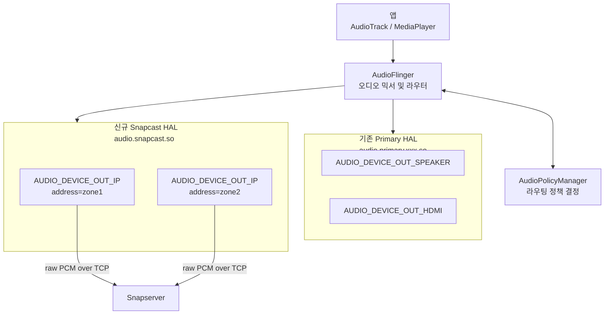
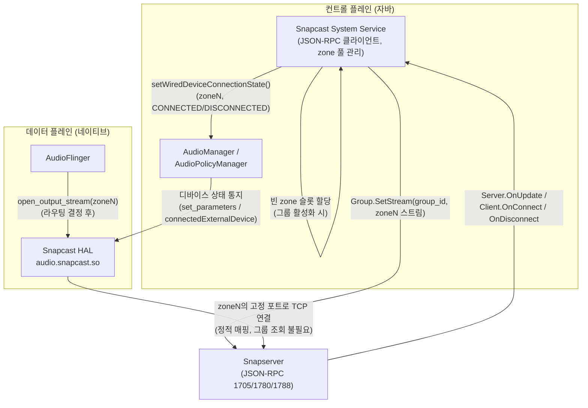
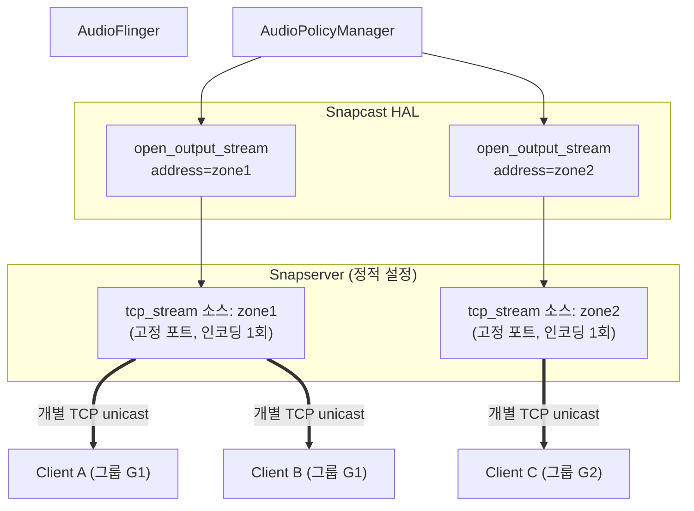
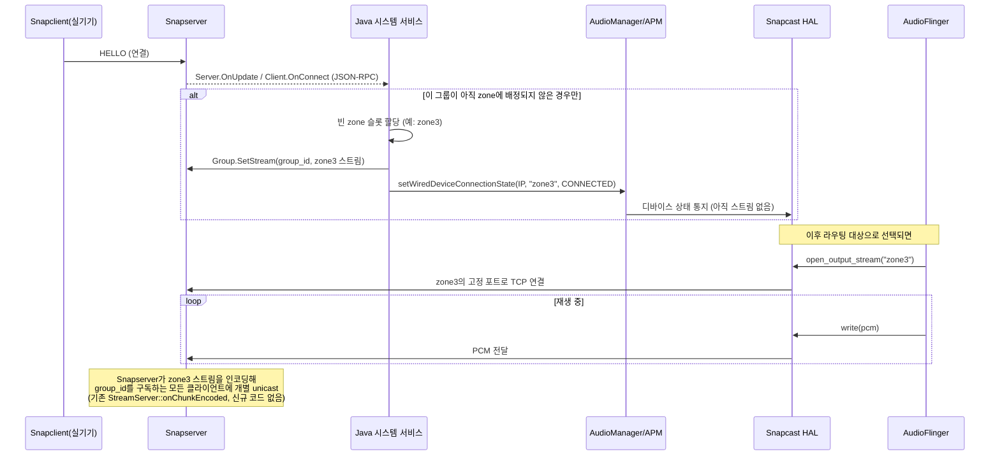

# Android Audio HAL 통합 설계

- 기존 Primary HAL은 그대로 두고, Snapcast 전용 신규 HAL 모듈을 추가하는 확정 설계다.
- 검토 중 나온 대안과 기각 이유는 각 절의 "설계 근거"에 정리했다.
- 본문에는 최종 채택된 구조만 적는다.

---

## 목표

- Snapcast 그룹(방/존 단위)이 활성화되면 `AUDIO_DEVICE_OUT_IP` 타입 디바이스를 동적으로 등록한다.
- 이 디바이스로 들어온 오디오는 Snapserver를 거쳐 해당 그룹의 클라이언트들에게 전달된다.

---

## 아키텍처

### 전체 구조



- `AUDIO_DEVICE_OUT_IP`는 Android에 이미 정의돼 있는 네트워크 오디오 출력 타입이다.
- 디바이스는 `(device_type, address)` 쌍으로 구분한다. 이는 APM(AudioPolicyManager)의 표준 동작 방식과 같다.
- Primary HAL은 그대로 둔다. `audio_policy_configuration.xml`에서 모듈만 분리하면 신규 HAL이 독립적으로 동작한다.

### 컴포넌트 역할 분리

- 세 컴포넌트는 각자 다른 층위를 책임진다.
- 서로의 내부 상태는 알 필요가 없도록 분리했다.

| 컴포넌트 | 책임 | 모르는 것 |
|---|---|---|
| **HAL** (네이티브, 데이터 플레인) | address(zone)별로 정해진 Snapserver TCP 포트에 PCM을 write | Snapcast의 그룹/클라이언트가 무엇인지, 몇 대가 붙어 있는지 |
| **Java 시스템 서비스** (컨트롤 플레인) | Snapserver JSON-RPC 구독, zone 풀 할당/반납, `Group.SetStream` 호출, `AudioManager` 등록/해제 | PCM 데이터 자체(전송에 관여하지 않음) |
| **Snapserver** (기존 기능, 변경 없음) | zone별 소스를 인코딩하고 `Group.streamId`로 구독 중인 모든 클라이언트에 개별 unicast | Android/HAL의 존재 자체 — 그냥 TCP로 들어오는 PCM 소스일 뿐 |

### 핵심 설계 결정: address는 "zone"(오디오 경로) 단위

- `address` 필드 값은 개별 Snapclient도 아니고, Snapcast `Group`의 UUID도 아니다.
- `address` 값은 **"zone"** 이다 — Java 시스템 서비스가 관리하는 유한한 풀에서 할당하는 짧은 슬롯 식별자다 (예: `"zone1"`, `"zone2"`, ...).
- zone 하나는 Snapserver에 미리 정의해 둔 `tcp_stream` 소스 하나와 1:1로 고정 연결된다.
- 그 소스를 실제로 어떤 Snapcast 그룹/클라이언트가 구독할지는 Snapserver의 기존 `Group.streamId` 설정이 담당한다.

**설계 근거**:
- **개별 클라이언트 단위(`host_id`/MAC)는 기각**
  - 같은 그룹 안의 클라이언트마다 HAL이 독립된 TCP 연결을 열면, Snapserver가 같은 오디오를 여러 번 중복 인코딩하게 된다.
  - 그러면 그룹 내 클라이언트끼리 인코딩 타이밍도 어긋난다.
  - HAL이 `host_id → group_id` 매핑을 직접 추적해서 이 문제를 풀어보는 방법도 검토했다.
  - 하지만 이는 Snapserver가 이미 하고 있는 일(하나의 소스를 여러 그룹/클라이언트에 개별 unicast로 나눠 보내는 것, `StreamServer::onChunkEncoded()` — [server/stream_server.cpp:72](../../server/stream_server.cpp#L72))을 HAL에서 또 만드는 셈이라 기각했다.
- **그룹 UUID(`Group.id`) 직접 사용은 기각**
  - Android의 device address 필드는 길이 제한이 있다. UUID(36자)에 접두어까지 붙이면 자리가 부족하거나 넘친다.
  - address는 원래 "개별 기기 식별"용 필드라서 의미상으로도 맞지 않는다.
- **zone 슬롯 채택**
  - 문자열이 짧아서 길이 제한 문제가 없다.
  - HAL이 그룹/클라이언트를 몰라도 되므로 데이터 플레인이 단순해진다.
  - 그룹→클라이언트로 나눠 보내는 작업(팬아웃)은 Snapserver의 기존 검증된 기능을 그대로 재사용한다.

---

## 컴포넌트별 설계

### Snapserver 설정 (정적)

- zone 개수(N)만큼 `tcp_stream` 소스를 배포 시점에 미리 정적으로 선언한다.
  - N은 동시에 활성화할 수 있는 그룹 수의 상한이다.
  - 예: zone1 → TCP 4001, zone2 → TCP 4002, ...
- 이는 이미 있는 다중 소스 기능([review/structure/03_server.md](../structure/03_server.md))을 그대로 쓰는 것이다.
- 서버 코드를 바꿀 필요가 없다.

- 각 Snapcast `Group`이 어떤 zone의 스트림을 구독할지는 `Group.SetStream(group_id, stream_id)` RPC로 지정한다.
- 한 zone을 여러 그룹이 동시에 구독하는 것도 그대로 지원한다 (예: G1과 G3가 같은 zone1을 구독).

### Java 시스템 서비스 (컨트롤 플레인)

- Snapserver의 컨트롤 API(JSON-RPC)를 구독한다.
- zone 풀을 관리한다.
- `AudioManager`/`Group.SetStream`을 호출한다.
- HAL에는 어떤 매핑 정보도 내려주지 않는다.



**zone 등록·해제 API** (Android 버전별):

| Android 버전 | 방식 |
|---|---|
| ~11 (Legacy/HIDL) | `set_parameters("connect=AUDIO_DEVICE_OUT_IP\|address=xxx")` |
| 12+ (AIDL) | `IModule.connectedExternalDevice()` / `disconnectedExternalDevice()` |

### HAL (데이터 플레인)

- HAL에는 Snapserver 이벤트 구독 기능이나 그룹/클라이언트 판단 로직이 전혀 없다.
- HAL이 아는 것은 딱 하나다 — **"이 zone(address)은 이 고정 포트로 연결한다"는 빌드 타임 정적 테이블**.



- G1(A, B)·G2(C) 같은 클라이언트 구성은 Snapcast의 기존 그룹 관리(`Group.SetClients`)가 담당한다.
- G1→zone1, G2→zone2 배정은 Java 서비스가 담당한다.
- **HAL은 zone 뒤에 클라이언트가 몇 대 붙어 있는지 몰라도 된다.**

두 가지 예외적 규칙만 HAL 내부에 필요하다:
1. **동일 zone 중복 연결 방지**
   - 드물게, 서로 다른 output profile(샘플레이트/flags)을 가진 두 PlaybackThread가 같은 zone address로 동시에 `open_output_stream()`을 호출할 수 있다.
   - 이때 zone당 TCP 연결이 두 번 열리면 안 된다. 그래서 **address 자체를 키로 하는 참조 카운트**를 둔다 (그룹 조회가 필요 없어 구조가 단순하다).
   - 대표(첫 스트림)만 실제로 `send()`한다. 나머지는 페이싱만 맞추고 성공을 반환한다.
   - 그렇지 않으면 하나의 TCP 스트림에 PCM이 뒤섞인다.
2. **스레드 세이프티**
   - HAL 데몬은 단일 프로세스다.
   - Binder 스레드풀(HIDL: `configureRpcThreadpool`, AIDL: `ABinderProcess_setThreadPoolMaxThreadCount`)이 여러 `open_output_stream()` 호출을 동시에 처리할 수 있다.
   - 그래서 위 참조 카운트 테이블은 뮤텍스로 보호한다.

---

## 동작 흐름

### zone 할당 및 연결 시퀀스

실제 Snapclient 접속부터 PCM 전송까지:



### 설계 규칙

1. **등록은 그룹(zone) 단위다. 클라이언트 단위가 아니다.**
   - [07_client_management.md](../structure/07_client_management.md)에서 보듯, Snapserver는 신규 그룹 생성 시 `Server.OnUpdate`를 보낸다. 기존 그룹에 재접속할 때는 `Client.OnConnect`를 보낸다.
   - Java 서비스는 **그 그룹이 이미 zone에 배정돼 있는지**를 자체 상태로 추적한다.
   - 아직 배정되지 않은 그룹이 처음 활성화될 때만 zone을 할당한다.
   - 이미 zone이 배정된 그룹에 클라이언트가 하나 더 붙는 경우(`Client.OnConnect`)는 무시한다.
2. **해제(Disconnect)도 그룹 단위로, 등록과 대칭이어야 한다.**
   - 그룹의 마지막 클라이언트가 끊기거나(`Client.OnDisconnect`) 그룹 자체가 삭제되면(`Config::remove(group)`), 서비스는 해당 zone에 `DISCONNECTED`를 호출하고 zone을 풀에 반납해야 한다.
   - 이걸 하지 않으면 죽은 zone이 라우팅 후보로 계속 남는다.
   - 그러면 zone 풀이 다 소진돼서 새 그룹이 zone을 배정받지 못할 수 있다.
3. **zone ↔ group_id 매핑은 Java 서비스 내부에만 존재한다.**
   - HAL은 zone 문자열과 그 zone의 고정 TCP 포트만 알면 된다.
   - 그룹 구성이 바뀌어도(`Group.SetClients`) HAL에는 아무것도 알릴 필요가 없다.
4. **"디바이스 등록"과 "스트림 전송"은 서로 다른 이벤트다.**
   - `AudioManager → AudioService → AudioPolicyManager → HAL`로 내려가는 것은 "이 zone의 디바이스가 존재한다"는 상태 통지일 뿐이다. 이 시점에는 PCM이 흐르지 않는다.
   - 이후 어떤 오디오 소스가 이 디바이스로 라우팅되도록 선택되면, 그제서야 `AudioFlinger`가 HAL의 `open_output_stream(zone)`을 호출한다.
   - 그때 비로소 HAL이 정적 매핑표에서 zone의 TCP 포트를 찾아 연결한다. 이후 `write()`가 호출될 때마다 PCM을 전달한다.

---

## 구현

### audio_policy_configuration.xml

신규 HAL 모듈에서 동적 디바이스 등록이 동작하려면 `dynamic="true"`가 필요하다.

> - zone 후보(zone1..zoneN)는 배포 시점에 이미 정해진 유한 집합이다.
> - 그래서 `dynamic="true"` 없이, N개의 `devicePort`를 정적으로 선언하고 `setWiredDeviceConnectionState()`/`connectedExternalDevice()`로 CONNECTED/DISCONNECTED 상태만 토글하는 방식도 가능하다.
> - 다만 이 방식은 지원할 zone 개수(N)를 벤더가 미리 정해둬야 하는 트레이드오프가 있다.
> - 아래 예시는 `dynamic="true"`를 사용하는 버전이다.

```xml
<!-- 기존 Primary HAL -->
<module name="primary" halVersion="2.0">
    <attachedDevices>
        <item>AUDIO_DEVICE_OUT_SPEAKER</item>
        <item>AUDIO_DEVICE_OUT_HDMI</item>
    </attachedDevices>
</module>

<!-- 신규 Snapcast HAL -->
<module name="snapcast" halVersion="2.0">
    <mixPorts>
        <mixPort name="snapcast output" role="source" maxActiveCount="8">
            <profile name="" format="AUDIO_FORMAT_PCM_16_BIT"
                     samplingRates="48000"
                     channelMasks="AUDIO_CHANNEL_OUT_STEREO"/>
        </mixPort>
    </mixPorts>
    <devicePorts>
        <devicePort tagName="Snapcast Out" type="AUDIO_DEVICE_OUT_IP"
                    role="sink" dynamic="true"/>
    </devicePorts>
    <routes>
        <route type="mix" sink="Snapcast Out" sources="snapcast output"/>
    </routes>
</module>
```

### HAL 구현 골격 (Legacy HAL 기준)

- 데이터 플레인 전용 골격이다.
- HAL이 담당하는 일은 두 가지뿐이다: zone→포트 정적 테이블 조회, 동일 zone에 대한 TCP 연결 공유(참조 카운트).

```c
// audio_snapcast.c

// zone(address) -> Snapserver 고정 포트. audio_policy_configuration.xml에 선언한
// zone 개수만큼 배포 시점에 정적으로 정의된다 (그룹/클라이언트와 무관).
static const struct { const char *zone; int port; } ZONE_PORTS[] = {
    { "zone1", 4001 },
    { "zone2", 4002 },
    // ...
};
#define MAX_ZONES (sizeof(ZONE_PORTS) / sizeof(ZONE_PORTS[0]))

// 드물게 서로 다른 output profile의 PlaybackThread 두 개가 같은 zone으로 동시에
// open_output_stream()을 호출할 수 있어, zone당 TCP 연결 1개만 유지한다.
// (그룹 조회 없이 address 자체가 곧 키이므로 훨씬 단순하다.)
struct snapcast_zone_conn {
    char zone[32];
    int  tcp_fd;
    int  refcount;
};
static struct snapcast_zone_conn g_conns[MAX_ZONES];
// Binder 스레드풀에서 여러 open_output_stream() 호출이 동시에 들어올 수 있어 보호 필요
static pthread_mutex_t g_conns_lock = PTHREAD_MUTEX_INITIALIZER;

static int port_for_zone(const char *zone)
{
    for (size_t i = 0; i < MAX_ZONES; i++)
        if (strcmp(ZONE_PORTS[i].zone, zone) == 0)
            return ZONE_PORTS[i].port;
    return -1;
}

// zone의 기존 연결을 재사용(refcount++)하거나 없으면 새로 연다.
// *out_is_owner는 이 호출이 해당 zone의 "첫" 스트림인지(=실제 send() 담당)를 락 안에서 확정한다.
static struct snapcast_zone_conn *acquire_zone_conn(const char *zone, bool *out_is_owner)
{
    pthread_mutex_lock(&g_conns_lock);
    struct snapcast_zone_conn *slot = NULL;
    for (size_t i = 0; i < MAX_ZONES; i++)
    {
        if (g_conns[i].tcp_fd > 0 && strcmp(g_conns[i].zone, zone) == 0)
        {
            g_conns[i].refcount++;
            slot = &g_conns[i];
            *out_is_owner = false;   // 이미 대표가 전송 중인 연결에 편승
            break;
        }
    }
    if (!slot)
    {
        for (size_t i = 0; i < MAX_ZONES; i++)
        {
            if (g_conns[i].tcp_fd <= 0)
            {
                strncpy(g_conns[i].zone, zone, sizeof(g_conns[i].zone) - 1);
                g_conns[i].tcp_fd = connect_to_snapserver_port(port_for_zone(zone));
                g_conns[i].refcount = 1;
                slot = &g_conns[i];
                *out_is_owner = true;   // 이 zone의 첫 스트림 = 대표
                break;
            }
        }
    }
    pthread_mutex_unlock(&g_conns_lock);
    return slot;
}

static void release_zone_conn(struct snapcast_zone_conn *z)
{
    pthread_mutex_lock(&g_conns_lock);
    if (--z->refcount == 0)
    {
        close(z->tcp_fd);
        memset(z, 0, sizeof(*z));
    }
    pthread_mutex_unlock(&g_conns_lock);
}

struct snapcast_stream_out {
    struct audio_stream_out stream;    // 반드시 첫 멤버
    struct snapcast_zone_conn *zone;   // 이 zone의 공유 TCP 연결
    bool is_owner;                     // 이 zone에 동시에 열린 스트림 중 대표만 실제 전송
};

// AudioFlinger가 매 버퍼마다 호출
static ssize_t out_write(struct audio_stream_out *stream,
                         const void *buffer, size_t bytes)
{
    struct snapcast_stream_out *out = (struct snapcast_stream_out *)stream;
    if (out->is_owner)
        return send(out->zone->tcp_fd, buffer, bytes, MSG_NOSIGNAL);
    // 같은 zone에 편승한 비대표 스트림: 대표가 이미 전송 중이므로 재전송하면
    // 하나의 TCP 스트림에 PCM이 뒤섞인다 — 실제 전송 없이 페이싱만 맞추고 성공 반환한다.
    pace_like_real_write(bytes);
    return bytes;
}

static int adev_open_output_stream(struct audio_hw_device *dev,
                                   audio_io_handle_t handle,
                                   audio_devices_t devices,
                                   audio_output_flags_t flags,
                                   struct audio_config *config,
                                   struct audio_stream_out **stream_out,
                                   const char *address)  // zone (예: "zone1")
{
    struct snapcast_stream_out *out = calloc(1, sizeof(*out));
    out->zone = acquire_zone_conn(address, &out->is_owner);

    out->stream.write = out_write;
    // ... 나머지 콜백 등록

    *stream_out = &out->stream;
    return 0;
}

static int adev_close_output_stream(struct audio_hw_device *dev,
                                    struct audio_stream_out *stream)
{
    struct snapcast_stream_out *out = (struct snapcast_stream_out *)stream;
    release_zone_conn(out->zone);   // refcount 0이 되면 TCP 연결 종료
    free(out);
    return 0;
}
```

### AOSP 빌드 통합

```
vendor/
└── mycompany/
    └── audio/
        ├── Android.bp
        ├── audio_snapcast.c
        └── audio_policy_configuration.xml
```

`Android.bp`:
```
cc_library_shared {
    name: "audio.snapcast",
    srcs: ["audio_snapcast.c"],
    shared_libs: ["liblog", "libcutils"],
    relative_install_path: "hw",
}
```

---

## 남은 검증 사항

- `setWiredDeviceConnectionState()`(또는 최신 `AudioDeviceAttributes` 기반 API)가 `AUDIO_DEVICE_OUT_IP` 타입에도 실제로 동작하는지, 대상 Android 버전에서 확인이 필요하다.
  - 이 API는 원래 유선 액세서리(wired accessory) 보고용으로 설계됐다.
- 이 API를 호출하려면 `MODIFY_AUDIO_SETTINGS_PRIVILEGED` 같은 시스템 권한이 필요하다.
  - 따라서 서비스는 privileged 앱이거나, 벤더 이미지에 시스템 서비스로 baked-in 되어 있어야 한다.
- 지원할 zone 개수(N, 동시 활성 그룹 수의 상한)를 제품 요구사항에 맞춰 결정해야 한다.
- [server/streamreader/tcp_stream.cpp](../../server/streamreader/tcp_stream.cpp)가 zone 개수만큼 동시 TCP 소스를 감당할 수 있는지 서버 쪽 검토가 필요하다.

---

## 구현 로드맵

1. 지원할 zone 개수(N) 결정 및 Snapserver에 zone 개수만큼 정적 `tcp_stream` 소스 사전 설정
2. 자바 시스템 서비스 구현: Snapserver JSON-RPC 클라이언트, zone 풀 할당/반납, `Group.SetStream` 호출, `AudioManager` 등록/해제
3. `setWiredDeviceConnectionState()`(또는 대체 API)의 `AUDIO_DEVICE_OUT_IP` 지원 여부 및 필요 권한을 타겟 Android 버전에서 검증
4. Android 버전 결정 후 HIDL / AIDL HAL 인터페이스 구현 (zone→포트 정적 테이블 + address 단위 참조 카운트)
5. [server/streamreader/tcp_stream.cpp](../../server/streamreader/tcp_stream.cpp) 동시 TCP 소스 처리 능력 서버 측 검토

## 관련 파일

| 파일 | 역할 |
|------|------|
| [server/streamreader/tcp_stream.cpp](../../server/streamreader/tcp_stream.cpp) / [.hpp](../../server/streamreader/tcp_stream.hpp) | 오디오 입력 TCP 소켓 (HAL이 zone별로 연결할 대상) |
| [common/message/hello.hpp](../../common/message/hello.hpp) | `host_id`(클라이언트 식별자) 정의 — 이번 설계에서는 HAL에 노출되지 않고 Java 서비스 내부에서만 사용 |
| [review/structure/03_server.md](../structure/03_server.md) | 서버가 여러 소스를 동시에 열어 서로 다른 클라이언트로 스트리밍하는 구조(이번 설계가 의존하는 기존 기능) |
| [review/structure/07_client_management.md](../structure/07_client_management.md) | 클라이언트 등록/그룹 관리 구조 (`Server.OnUpdate`/`Client.OnConnect`/`OnDisconnect` 이벤트) |
| [review/structure/08_control_stream_flow.md](../structure/08_control_stream_flow.md) | 제어(JSON-RPC)/스트림(오디오) 전송 흐름 |
| [02_android_client.md](02_android_client.md) | Android가 Snapcast 클라이언트 역할을 겸하는 통합 검토 (서버 역할과의 공존/모드 전환 포함) |
