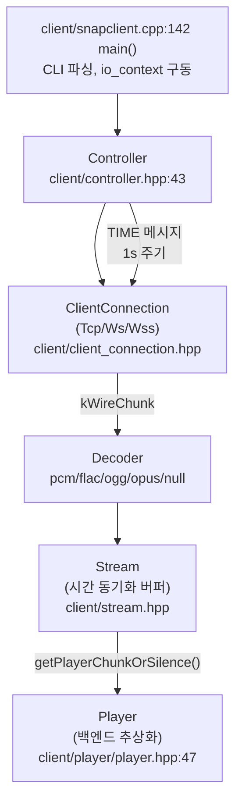
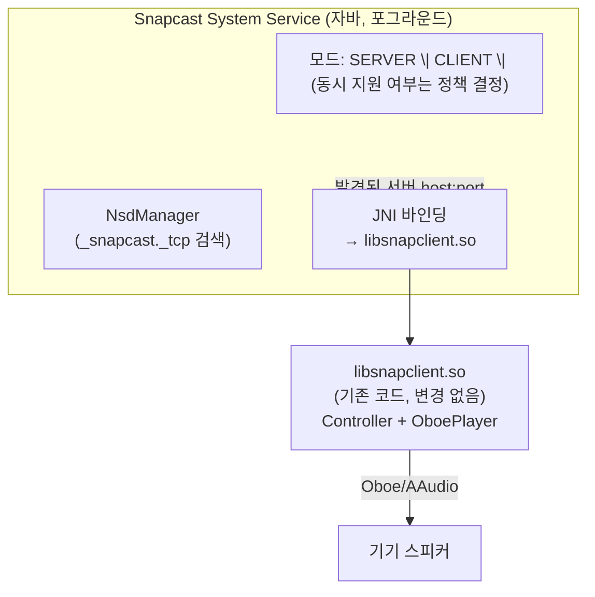

# Android Snapcast 클라이언트 통합 검토

[android_hal.md](android_hal.md)는 Android가 Snapcast **서버** 역할(자체 오디오를 zone으로 내보내 다른 클라이언트에 배포)을 수행하는 설계였다. 이 문서는 그 반대 방향 — Android 기기가 Snapcast **클라이언트** 역할(원격 Snapserver의 오디오를 받아 자신의 스피커로 재생)도 함께 수행할 수 있도록 통합하는 방안을 검토한다. 최종 목표는 하나의 Android 기기가 상황에 따라 서버도, 클라이언트도 될 수 있는 것이다.

---

## 목표

Android 기기가 원격 Snapserver에 접속해 오디오를 수신·재생할 수 있게 하고, 이미 설계된 서버 역할(HAL + Java 시스템 서비스)과 공존시킨다.

---

## 기존 자산: snapdroid 패턴이 이미 존재한다

검토 전에 먼저 확인해야 할 것은 "얼마나 새로 만들어야 하는가"다. 조사 결과, **이 저장소에는 이미 성숙한 Android 클라이언트 포팅이 존재하고, 실제로 공식 배포 중인 Android 앱("snapdroid")에 그대로 쓰이고 있다.**

### 클라이언트 아키텍처 개요

- `Controller`(`client/controller.hpp:43`, `.cpp`)가 연결·디코더·플레이어를 총괄한다. `kCodecHeader` 수신 시 디코더/스트림/플레이어 파이프라인을 전부 재구성하고, `kServerSettings`로 버퍼 길이를 설정하며, `kWireChunk`를 디코드해 `Stream`에 채운다(`controller.cpp:184` 이하).
- `ClientConnection`은 Snapcast 고유의 길이-프리픽스 바이너리 프로토콜을 구현한다(JSON-RPC와는 별개 — JSON-RPC는 서버의 원격 제어 API).
- `Stream`(`client/stream.cpp`)이 시간 동기화의 핵심이다 — 아래 참고.

### 오디오 플레이어 백엔드 — Android용이 이미 2개 있다

`client/player/player.hpp:47`의 추상 `Player` 기반 위에 플랫폼별 백엔드가 있는데, **Android용 백엔드가 이미 두 개 존재한다**:

| 백엔드 | 게이트 | 특징 |
|---|---|---|
| `player::OboePlayer` (`oboe_player.cpp/.hpp:41`) | `HAS_OBOE`, Android 전용 | Google Oboe 래핑. Android 8.1+는 AAudio, 4.1+는 OpenSL ES를 내부적으로 선택. **콜백 기반**(`needsThread()==false`), `getCurrentOutputLatencyMillis()`(`oboe_player.cpp:138`)로 `AudioStream::getTimestamp(CLOCK_MONOTONIC)` 기반 동적 출력 레이턴시를 추정해 동기화 로직에 공급 |
| `player::OpenslPlayer` (`opensl_player.cpp/.hpp:47`) | `HAS_OPENSL`, Android 전용 | 저수준 OpenSL ES 직접 구현. 고정 50ms 지연을 가정(`opensl_player.cpp:80-96`) — 동적 레이턴시 쿼리 없음 |

두 백엔드 모두 `client/CMakeLists.txt:93-105`에서 Android 빌드 시 무조건 포함되고, `oboe::oboe`/`OpenSLES`/`log`를 링크한다. Android 빌드는 일반 실행 파일이 아니라 `libsnapclient.so`(`client/CMakeLists.txt:147-149`, JNI로 로드되는 형태)로 산출된다. README에도 두 백엔드가 공식 문서화되어 있다(`README.md:122-123`).

### 시간 동기화와 레이턴시 — Android 이식에 필요한 정보가 이미 정의돼 있다

- `TimeProvider`(`client/time_provider.hpp:40`)가 서버와의 클럭 오프셋을 중앙값 필터로 유지한다(`TimeProvider::serverNow()` = 로컬 시각 + 오프셋). 클라이언트의 절대 시계 정확도는 중요하지 않고, 서버와의 **측정된 차이**만 중요하다.
- 각 플레이어 백엔드는 오디오 콜백마다 "지금 쓴 버퍼가 실제로 스피커에서 들리기까지 걸리는 시간"을 추정해 `Stream::getPlayerChunk(..., outputBufferDacTime, ...)`(`client/stream.hpp:64`)에 넘긴다. `OboePlayer::getCurrentOutputLatencyMillis()`가 정확히 이 패턴이며, **`AudioTrack.getTimestamp()`(프레임 위치 + `CLOCK_MONOTONIC` 나노초)가 Oboe의 `getTimestamp(CLOCK_MONOTONIC)`와 구조적으로 동일**하다 — 즉 Java/Kotlin `AudioTrack` 기반 플레이어를 새로 만들더라도 같은 추정 공식을 그대로 재사용할 수 있다.
- 동기화 보정은 하드 싱크(500ms 이상 어긋나면 청크를 건너뛰거나 무음 삽입, `stream.cpp:388-407`)와 소프트 싱크(초당 ±0.05% 이내로 프레임을 드롭/중복해 미세 보정, `stream.cpp:166-243`)의 2단계로 이뤄진다. 이 로직은 플랫폼과 무관해 그대로 재사용된다.

### 서버 디스커버리 — Android에서는 완전히 빠져 있다

`Controller::browseMdns()`(`controller.cpp:379-416`)는 `HAS_MDNS`가 정의된 경우에만 동작하는데, 루트 `CMakeLists.txt:209`의 `if(NOT WIN32 AND NOT ANDROID)`가 Avahi/Bonjour/mDNS 정의 블록 전체를 감싸고, `client/CMakeLists.txt:43`의 `elseif(NOT ANDROID)`도 Android에서는 `browse_avahi.cpp`를 아예 빌드에서 제외한다. **즉 오늘날의 Android 빌드는 mDNS 디스커버리가 전혀 없고, 서버 주소를 외부에서(앱의 Kotlin/Java 레이어 등) 명시적으로 넘겨줘야 한다.**

### 빌드/포팅 현황

- 루트 `CMakeLists.txt:51-53`가 `ANDROID`를 `MACOSX`/`WIN32`와 동급의 1급 플랫폼으로 다룬다. Android는 vcpkg CONFIG 패키지로 `oboe`/`flac`/`ogg`/`opus`/`soxr`/`tremor`/`boost`를 받는다(`CMakeLists.txt:322-337`).
- `_CMakePresets.json:72-160`에 `android-x86`/`android-x86_64`/`android-armeabi-v7a`/`android-arm64-v8a` 4개 ABI용 CMake 프리셋이 이미 구성돼 있다.
- `common/utils.hpp`는 Android 시스템 프로퍼티(`__system_property_get`)로 `getOS()`/`getHostName()`/`getArch()`/`getHostId()`를 구현하고, Android 6(API 23)+에서 WifiInfo MAC이 더미값(`02:00:00:00:00:00`)을 반환하는 것까지 이미 특수 처리돼 있다(`common/utils.hpp:424`). `common/aixlog.hpp`도 `__android_log_write` 기반 `SinkAndroid`를 갖고 있다.
- `doc/build.md:207-218`와 `README.md:179-183`가 확인해주듯, **오늘날 실제 배포 방식은 별도 저장소 [snapdroid](https://github.com/snapcast/snapdroid)가 이 저장소를 git submodule로 포함해 `libsnapclient.so`를 4개 ABI로 크로스컴파일하고, 그 위에 Kotlin/Java UI + JSON-RPC 제어 + (추정) NSD 기반 디스커버리를 얹어 APK로 배포하는 것**이다. Google Play에 공개 배포 중인 앱이다.

---

## 검토 결과

### 긍정적 평가

- **오디오 재생 파이프라인(디코딩, 시간 동기화, 플레이어 백엔드)은 이미 프로덕션 검증된 상태다.** 새로 설계할 필요가 없다.
- **두 개의 Android 오디오 백엔드가 이미 있고, 그중 Oboe는 AudioTrack.getTimestamp()와 동일한 구조의 동적 레이턴시 추정을 이미 구현해 정확도가 검증돼 있다.**

### 검토 사항 1: 아키텍처 옵션 — 앱 임베드(JNI) 유지 vs HAL 레벨 통합

서버 역할(android_hal.md)은 "이 오디오를 시스템의 다른 앱들이 라우팅 대상으로 선택할 수 있어야 한다"는 요구 때문에 HAL까지 내려가야 했다. **클라이언트 역할은 그럴 필요가 원천적으로 없다** — 원격 스트림을 "재생"하는 것은 이 기능 자체가 최종 소비자이지, 다른 앱이 선택할 "출력 대상"이 아니다.

| 방식 | 설명 | 평가 |
|---|---|---|
| **앱/서비스 임베드(JNI) — snapdroid 패턴 유지 (권장)** | 기존 `libsnapclient.so`(Oboe 백엔드)를 그대로 JNI로 포그라운드 서비스에 임베드, `AudioTrack`/Oboe로 재생 | 이미 검증된 방식. 구현 비용 최소. HAL 변경 불필요 |
| HAL 레벨 통합 (예: 커스텀 `AUDIO_DEVICE_IN` 또는 별도 오디오 소스로 시스템에 노출) | 클라이언트가 받은 오디오를 HAL을 거쳐 시스템 오디오 그래프의 입력으로 노출 | 이 기능을 다른 앱이 "소스"로 선택해 자기 오디오 파이프라인에 섞어야 하는 요구가 없다면 불필요한 복잡도. 오디오 포커스/믹싱 정책과도 충돌 소지 |

**권장**: HAL 통합 없이 기존 snapdroid 패턴(네이티브 `libsnapclient.so` + Oboe, 포그라운드 서비스에 JNI로 임베드)을 그대로 재사용한다.

### 검토 사항 2: 서버 역할과의 공존 (모드 전환)

같은 기기가 서버 역할(자체 Snapserver + HAL zone)과 클라이언트 역할(원격 Snapserver 재생)을 동시에/전환하며 수행해야 한다.

- **프로세스 관점에서는 문제 없다**: `snapserver`와 클라이언트 로직은 독립 프로세스/컴포넌트이므로 기술적으로 동시 실행 가능하다.
- **물리적 출력은 하나뿐이라는 제약은 남는다**: 이 기기의 스피커가 (a) 자신이 서버 역할로 만들어낸 zone 오디오도 재생하면서 동시에 (b) 원격 서버의 스트림도 재생하는 상황은 오디오가 섞이거나 충돌한다 — 어느 쪽이 우선인지는 **AudioManager 포커스/APM 라우팅 정책으로 중재해야 하는 제품 정책 결정 사항**이지 기술적으로 자동 해소되지 않는다.
- **미결**: 모드 전환을 사용자가 명시적으로 선택하게 할지(예: "지금 이 방은 재생 전용" vs "이 방은 소스"), 아니면 자동 판단(오디오 포커스 요청 유무 등)으로 할지 결정 필요.
- 이미 설계된 자바 시스템 서비스(android_hal.md의 zone 풀 관리자)에 클라이언트 모드를 통합할지, 별도 서비스로 분리할지도 결정 필요 — 포그라운드 서비스/배터리 최적화 예외를 하나로 관리하려면 통합이 유리하다.

### 검토 사항 3: Android 특유 제약

- **백그라운드 실행**: Android는 백그라운드 프로세스를 제한한다. 지속적인 TCP 연결과 오디오 콜백을 유지하려면 포그라운드 서비스(지속 알림) + 배터리 최적화 예외가 필요하다 — snapdroid도 동일한 문제를 이미 겪고 해결했을 것이므로 그 구현을 참고할 수 있다.
- **오디오 포커스**: 다른 앱(전화, 다른 미디어 앱)이 오디오 포커스를 요청하면 시스템이 재생을 덕킹/일시정지시킨다. 전용 스피커 기기와 달리 범용 Android 기기는 이 상호작용을 설계해야 한다(예: `USAGE_MEDIA`로 포커스를 잡고 일시적 손실은 무시할지, 아니면 존중해서 일시정지할지).
- **멀티캐스트 제한**: 아래 디스커버리 이슈와 연결되는데, Android는 배터리 절약을 위해 기본적으로 멀티캐스트 패킷을 필터링한다.

### 검토 사항 4: 서버 디스커버리 공백

네이티브 mDNS가 Android에서 완전히 빠져 있으므로(위 "기존 자산" 참고), 다음 중 하나가 필요하다:
- **Android `NsdManager`**(Network Service Discovery)로 `_snapcast._tcp` 서비스를 검색해 IP:port를 얻은 뒤, 네이티브 레이어의 `browseMdns()`를 우회하고 `--host`에 해당하는 값을 직접 넘긴다.
- 멀티캐스트 기반 검색을 직접 구현한다면 `WifiManager.MulticastLock`을 명시적으로 잡아야 한다(기본적으로 필터링됨).
- 또는 서버 주소를 사용자가 수동 입력하게 하거나, 이미 서버 역할 설계에서 만든 자바 시스템 서비스가 알고 있는 정보(같은 네트워크의 다른 Snapcast 기기 목록)를 활용한다.

---

## 권장 아키텍처 (초안)

- 네이티브 `libsnapclient.so`(Controller, Decoder, Stream, OboePlayer)는 **변경 없이 그대로 재사용**한다.
- 서버 역할(android_hal.md)에서 이미 설계한 Java 시스템 서비스에 클라이언트 모드를 추가해, `NsdManager` 기반 디스커버리 + JNI 호출 + 포그라운드 서비스 생명주기를 한 곳에서 관리한다.
- 서버/클라이언트 동시 활성 시의 오디오 라우팅 중재는 이번 설계 범위에서 정책 결정 사항으로 남긴다(아래 검증 사항 참고).

---

## 남은 검증 사항

- 서버 모드와 클라이언트 모드를 한 기기에서 동시에 켤 수 있게 할지, 상호 배타적으로 할지 제품 정책 결정 필요.
- `NsdManager` 기반 디스커버리를 네이티브 `browseMdns()` 대신 자바 레이어에서 어떻게 네이티브로 전달할지(JNI 인터페이스 설계) 구체화 필요.
- 포그라운드 서비스의 배터리 최적화 예외 처리 방식(사용자 동의 플로우 포함) 검증 필요.
- 오디오 포커스 정책(다른 앱과의 충돌 시 동작) 결정 필요.
- `OpenslPlayer`의 고정 50ms 레이턴시 가정이 실제 목표 기기에서 허용 가능한 동기화 오차 범위인지, 아니면 `OboePlayer`(동적 레이턴시)만 지원할지 결정 필요.

---

## 다음 단계

1. 서버/클라이언트 동시 지원 여부 및 모드 전환 UX 정책 결정
2. 자바 시스템 서비스에 클라이언트 모드 추가: `NsdManager` 디스커버리 + JNI 바인딩 + 포그라운드 서비스 수명 관리
3. snapdroid 프로젝트의 기존 JNI/배터리 최적화/오디오 포커스 구현 조사 후 재사용 가능 여부 확인
4. 오디오 포커스·라우팅 중재 정책 설계 (서버 zone 오디오 vs 원격 클라이언트 재생이 동시에 활성화될 때)
5. 타겟 Android 버전 확정 후 `OboePlayer` 단독 지원 여부 결정 (`OpenslPlayer`는 고정 레이턴시라 동기화 정확도가 떨어짐)

## 관련 파일

| 파일 | 역할 |
|------|------|
| [client/controller.hpp](../../client/controller.hpp) / [.cpp](../../client/controller.cpp) | 클라이언트 연결·디코더·플레이어 총괄 |
| [client/player/oboe_player.hpp](../../client/player/oboe_player.hpp) / [.cpp](../../client/player/oboe_player.cpp) | Android Oboe 플레이어 백엔드 (권장) |
| [client/player/opensl_player.hpp](../../client/player/opensl_player.hpp) / [.cpp](../../client/player/opensl_player.cpp) | Android OpenSL ES 플레이어 백엔드 (고정 레이턴시) |
| [client/time_provider.hpp](../../client/time_provider.hpp) / [.cpp](../../client/time_provider.cpp) | 서버-클라이언트 클럭 오프셋 관리 |
| [client/stream.hpp](../../client/stream.hpp) / [.cpp](../../client/stream.cpp) | 시간 동기화 버퍼 및 하드/소프트 싱크 로직 |
| [client/browseZeroConf/browse_mdns.hpp](../../client/browseZeroConf/browse_mdns.hpp) | mDNS 디스커버리 추상 인터페이스 (Android에서는 빌드 제외) |
| [client/CMakeLists.txt](../../client/CMakeLists.txt) | Android 빌드 타깃(`libsnapclient.so`) 및 백엔드 게이팅 |
| [_CMakePresets.json](../../_CMakePresets.json) | Android 4개 ABI CMake 프리셋 |
| [doc/build.md](../../doc/build.md) | snapdroid 기반 Android 빌드/배포 방식 문서 |
| [android_hal.md](android_hal.md) | Android 서버 역할 통합 설계 (이 문서와 공존해야 하는 대상) |
