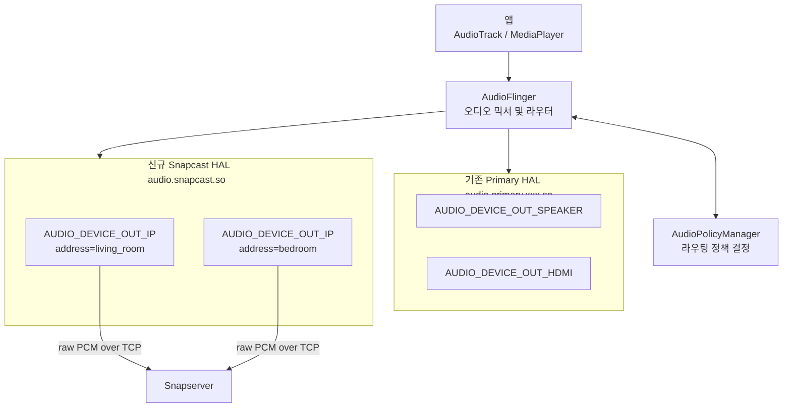
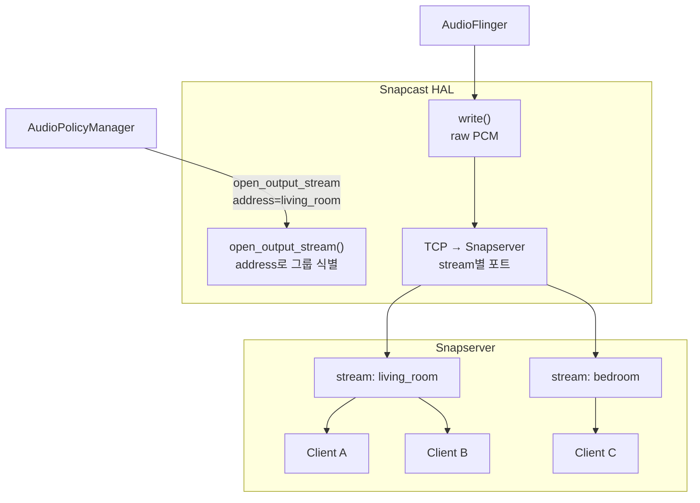
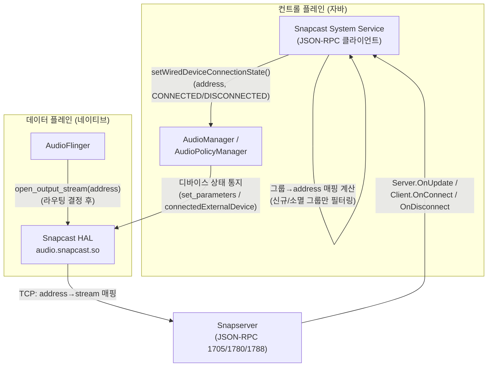
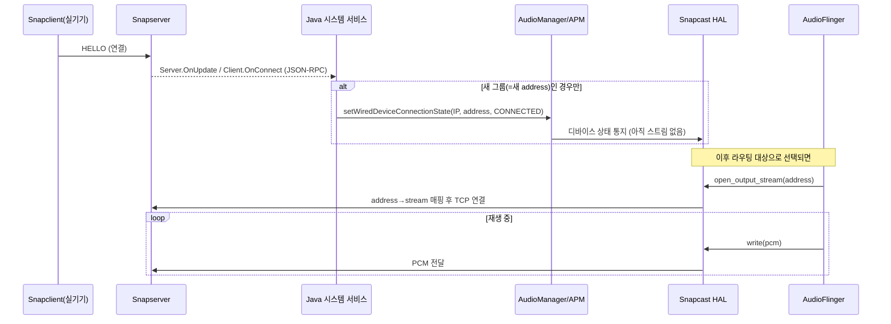

# Android Audio HAL 통합 검토

## 목표

기존 Primary HAL을 유지하면서 Snapcast 전용 신규 HAL 모듈을 추가한다.
클라이언트 장치가 추가될 때 `AUDIO_DEVICE_OUT_IP` 타입 디바이스를 동적으로 등록하고, `address` 필드로 개별 클라이언트를 구분하는 방안을 검토한다.

---

## Android 오디오 스택 구조



---

## 검토 결과

### 긍정적 평가

- **`AUDIO_DEVICE_OUT_IP` 선택 적합** — Android에 이미 정의된 네트워크 오디오 출력 타입이며, `(device_type, address)` 쌍으로 디바이스를 구분하는 방식이 APM 표준 동작과 일치한다.
- **Primary HAL 유지 + 신규 HAL 추가 구조 가능** — `audio_policy_configuration.xml` 에서 모듈을 분리하면 독립적으로 동작한다.

---

### 문제점 1: 클라이언트 단위 vs 스트림/그룹 단위 불일치 (핵심)

Snapcast는 서버가 동일 스트림을 여러 클라이언트에 배포하는 구조다.
클라이언트 1개 = HAL 디바이스 1개로 매핑하면 AudioFlinger는 디바이스마다 독립 MixPort(출력 스트림)를 열려고 한다.
같은 그룹의 클라이언트가 동일한 오디오를 받아야 하는데 HAL이 PCM을 클라이언트 수만큼 중복 수신하게 되어 낭비 및 동기화 오차가 발생한다.

**권장**: 디바이스 단위를 **클라이언트**가 아닌 **Snapcast 그룹/스트림** 으로 설정한다.

```
AUDIO_DEVICE_OUT_IP + address="living_room" → Snapserver stream "living_room" → 클라이언트 N개
AUDIO_DEVICE_OUT_IP + address="bedroom"     → Snapserver stream "bedroom"     → 클라이언트 M개
```



> **참고**: 그룹 추가/제거를 APM에 통지해 디바이스를 동적으로 (dis)connect 시키는 경로는 HAL이 직접 담당하지 않는다. 이 컨트롤 플레인 책임은 [해결 방안: 자바 레이어 시스템 서비스](#해결-방안-자바-레이어-시스템-서비스-컨트롤-플레인--데이터-플레인-분리) 절에서 별도 Java 시스템 서비스로 분리했다 — HAL은 `open_output_stream()`이 호출된 이후의 데이터 플레인(TCP write)만 담당한다.

> **참고**: 위 다이어그램의 `S1 --> C1A / C1B`는 "그룹을 거쳐 클라이언트로 전달된다"는 뜻이 아니다. Snapserver는 그룹을 네트워크 홉이 아닌 **설정(config) 상의 스트림 구독 매핑**으로만 관리한다 — `Group`은 `streamId` + `clients[]`를 갖는 순수 데이터 구조이고([server/config.hpp](../../server/config.hpp)), 인코딩된 오디오는 스트림당 한 번만 만들어진 뒤 `StreamServer::onChunkEncoded()`가 `pcmStream()`이 일치하는 모든 클라이언트 세션에 **개별 TCP unicast**로 직접 전송한다([server/stream_server.cpp:72](../../server/stream_server.cpp#L72)). 즉 그룹은 "어떤 클라이언트가 어떤 스트림을 구독하는지"를 결정하는 매핑 정보일 뿐, 실제 전송 경로에 별도로 개입하지 않는다.

---

### 문제점 2: address 식별자로 IP 사용 시 문제

| 문제 | 내용 |
|------|------|
| DHCP 변경 | 클라이언트 IP가 바뀌면 동일 기기 구분 불가 |
| 중복 가능 | 동일 IP에서 복수 Snapclient 인스턴스 실행 가능 |

**권장**: Snapcast 내부 `host_id` (MAC 주소 기반, [common/message/hello.hpp](../../common/message/hello.hpp)) 를 address로 사용한다.

```
address = "snapcast:<host_id>"    예: "snapcast:aa:bb:cc:dd:ee:ff"
```

---

### 문제점 3: 동적 디바이스 등록 메커니즘

클라이언트(또는 그룹) 추가·제거 이벤트를 APM에 전달하는 방식이 Android 버전별로 다르다.

| Android 버전 | 방식 |
|---|---|
| ~11 (Legacy/HIDL) | `set_parameters("connect=AUDIO_DEVICE_OUT_IP\|address=xxx")` |
| 12+ (AIDL) | `IModule.connectedExternalDevice()` / `disconnectedExternalDevice()` |

또한 Snapserver(네이티브 프로세스)가 새 클라이언트 연결을 HAL에 알릴 IPC 채널 설계가 필요하다 — 아래 "자바 레이어 시스템 서비스" 구조로 해결한다.

---

### 해결 방안: 자바 레이어 시스템 서비스 (컨트롤 플레인 / 데이터 플레인 분리)

HAL(네이티브)에 Snapserver JSON-RPC 클라이언트나 IPC 리스너를 직접 구현하는 대신, **Snapserver의 컨트롤 API를 구독하고 `AudioManager`로 디바이스를 등록/해제하는 자바 시스템 서비스**를 둔다. HAL은 순수하게 "PCM을 해당 address의 TCP 소켓으로 전달"하는 데이터 플레인 역할만 담당한다.



**연결(Connect) 시퀀스** — 실제 Snapclient 접속부터 PCM 전송까지:



핵심 설계 포인트 (일반적인 "클라이언트 연결 = 즉시 등록/전송"이라는 단순화된 이해와 실제로 다른 지점):

1. **등록은 그룹 단위, 클라이언트 단위가 아니다.** [07_client_management.md](../structure/07_client_management.md)에서 보듯 Snapserver는 신규 그룹 생성 시 `Server.OnUpdate`를, 기존 그룹에 재접속 시 `Client.OnConnect`를 보낸다. Java 서비스는 **해당 group의 address가 이미 AudioManager에 등록돼 있는지 자체 상태로 추적**해서, 새로 활성화되는 경우에만 `CONNECTED`를 호출해야 한다 — 이미 등록된 그룹에 클라이언트가 하나 더 붙는 경우는 무시.
2. **해제(Disconnect)는 대칭으로 필요하다.** 그룹의 마지막 클라이언트가 끊기면(`Client.OnDisconnect`, 또는 `Group.SetClients`로 그룹이 비어 `Config::remove(group)`되는 경우) 서비스가 `DISCONNECTED`를 호출해 디바이스 등록을 해제해야 한다. 하지 않으면 죽은 그룹의 주소가 라우팅 후보로 계속 남는다.
3. **"디바이스 등록"과 "스트림 전송"은 별개의 이벤트다.** `AudioManager → AudioService → AudioPolicyManager → HAL`로 내려가는 것은 "이 address의 디바이스가 존재한다"는 상태 통지일 뿐이며, 이 시점엔 PCM이 흐르지 않는다. 이후 어떤 오디오 소스가 이 디바이스로 라우팅되도록 **선택된 뒤**에야 `AudioFlinger`가 HAL의 `open_output_stream(address)`를 호출하고, 그때 비로소 HAL이 address로 Snapserver의 어떤 stream에 TCP 연결할지 정하고 `write()`마다 PCM을 전달한다.

**남은 검증 사항**:
- `setWiredDeviceConnectionState()`(또는 최신 `AudioDeviceAttributes` 기반 API)가 `AUDIO_DEVICE_OUT_IP` 타입에도 실제로 동작하는지 대상 Android 버전에서 확인 필요 — 원래 이 API는 wired accessory 보고용으로 설계되었다.
- 이 API 호출에는 `MODIFY_AUDIO_SETTINGS_PRIVILEGED` 등 시스템 권한이 필요하므로, 서비스는 privileged 앱이거나 벤더 이미지에 시스템 서비스로 baked-in 되어야 한다.

---

### 문제점 4: audio_policy_configuration.xml 설정

신규 HAL 모듈에서 동적 디바이스 등록이 동작하려면 `dynamic="true"` 가 필수다.

```xml
<!-- 기존 Primary HAL -->
<module name="primary" halVersion="2.0">
    <attachedDevices>
        <item>AUDIO_DEVICE_OUT_SPEAKER</item>
        <item>AUDIO_DEVICE_OUT_HDMI</item>
    </attachedDevices>
</module>

<!-- 신규 Snapcast HAL -->
<module name="snapcast" halVersion="2.0">
    <mixPorts>
        <mixPort name="snapcast output" role="source" maxActiveCount="8">
            <profile name="" format="AUDIO_FORMAT_PCM_16_BIT"
                     samplingRates="48000"
                     channelMasks="AUDIO_CHANNEL_OUT_STEREO"/>
        </mixPort>
    </mixPorts>
    <devicePorts>
        <devicePort tagName="Snapcast Out" type="AUDIO_DEVICE_OUT_IP"
                    role="sink" dynamic="true"/>
    </devicePorts>
    <routes>
        <route type="mix" sink="Snapcast Out" sources="snapcast output"/>
    </routes>
</module>
```

---

## HAL 구현 골격 (Legacy HAL 기준)

데이터 플레인 전용 골격이다. Snapserver 이벤트 구독이나 그룹 상태 판단 로직은 없다 — 그건 자바 시스템 서비스의 책임이며, HAL은 `open_output_stream()`에 전달된 `address`로 어느 TCP 소켓에 연결할지만 정하면 된다.

```c
// audio_snapcast.c

struct snapcast_stream_out {
    struct audio_stream_out stream;  // 반드시 첫 멤버
    int tcp_fd;                      // Snapserver TCP 소켓
    char group_address[64];          // 그룹 식별자 (address)
};

// AudioFlinger가 매 버퍼마다 호출
static ssize_t out_write(struct audio_stream_out *stream,
                         const void *buffer, size_t bytes)
{
    struct snapcast_stream_out *out = (struct snapcast_stream_out *)stream;
    return send(out->tcp_fd, buffer, bytes, MSG_NOSIGNAL);
}

static int adev_open_output_stream(struct audio_hw_device *dev,
                                   audio_io_handle_t handle,
                                   audio_devices_t devices,
                                   audio_output_flags_t flags,
                                   struct audio_config *config,
                                   struct audio_stream_out **stream_out,
                                   const char *address)  // 그룹명 또는 host_id
{
    struct snapcast_stream_out *out = calloc(1, sizeof(*out));
    strncpy(out->group_address, address, sizeof(out->group_address) - 1);

    // Snapserver의 해당 그룹 포트로 TCP 연결
    out->tcp_fd = connect_to_snapserver(address);

    out->stream.write = out_write;
    // ... 나머지 콜백 등록

    *stream_out = &out->stream;
    return 0;
}
```

---

## AOSP 빌드 통합

```
vendor/
└── mycompany/
    └── audio/
        ├── Android.bp
        ├── audio_snapcast.c
        └── audio_policy_configuration.xml
```

`Android.bp`:
```
cc_library_shared {
    name: "audio.snapcast",
    srcs: ["audio_snapcast.c"],
    shared_libs: ["liblog", "libcutils"],
    relative_install_path: "hw",
}
```

---

## 결론 및 다음 단계

| 항목 | 결정 |
|------|------|
| `AUDIO_DEVICE_OUT_IP` 사용 | 확정 |
| address 단위 | **클라이언트 IP → Snapcast 그룹/스트림명으로 변경** |
| address 식별자 | **IP → host_id (MAC 기반) 권장** |
| Primary HAL 분리 | `audio_policy_configuration.xml` 모듈 분리로 해결 |
| 동적 디바이스 등록 | `dynamic="true"` + Android 버전별 등록 API |
| HAL ↔ Snapserver IPC | **컨트롤 플레인/데이터 플레인 분리로 해결**: 자바 시스템 서비스가 Snapserver JSON-RPC를 구독해 `AudioManager`로 디바이스 등록/해제, HAL은 데이터 플레인(TCP write)만 담당하므로 별도 IPC 불필요 |

**다음 작업 후보**:
1. Snapcast 그룹/스트림 기반 HAL 디바이스 매핑 설계
2. 자바 시스템 서비스 구현: Snapserver JSON-RPC 클라이언트, 그룹→address 상태 추적(신규/소멸 필터링), `AudioManager` 등록/해제 호출
3. `setWiredDeviceConnectionState()`(또는 대체 API)의 `AUDIO_DEVICE_OUT_IP` 지원 여부 및 필요 권한을 타겟 Android 버전에서 검증
4. Android 버전 결정 후 HIDL / AIDL HAL 인터페이스 구현
5. [server/streamreader/tcp_stream.cpp](../../server/streamreader/tcp_stream.cpp)의 `mode=client` 를 그룹별 다중 포트로 확장하는 서버 측 수정 검토
