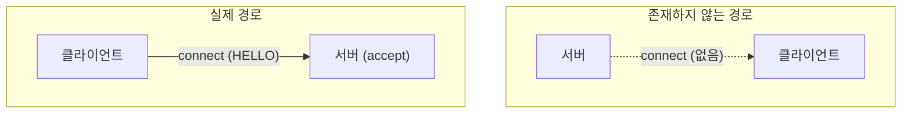

# 연결 방향성과 디바이스 가시성 — Android 통합에 대한 함의

- [00_overview.md](00_overview.md)는 서버 역할([android_hal.md](android_hal.md))과 클라이언트 역할([android_client.md](android_client.md)), 두 가지 설계를 다룬다.
- 두 설계 모두 Snapcast 프로토콜의 근본 제약 하나를 따른다.
- 그 제약은 다음과 같다: **연결은 항상 클라이언트가 먼저 건다.**
- 이 문서는 이 제약을 코드로 확인하고, 두 설계 문서에 각각 어떤 영향을 주는지 정리한다.

---

## 확정된 사실: 연결은 클라이언트 → 서버로만 열린다

### 서버는 accept만 한다

```
server/stream_server.cpp:232   acceptor_.emplace_back(make_unique<tcp::acceptor>(...))
server/stream_server.cpp:194   acceptor->async_accept(accept_handler)
```

- `server/stream_server.cpp`, `server/server.cpp`, `server/control_server.cpp` 어디에도 클라이언트로 향하는 `connect()`/`async_connect()` 호출이 없다.
- 서버는 리스닝 소켓을 열고, 들어오는 연결을 받기만 한다.
- 서버가 특정 클라이언트에게 먼저 연결을 걸어 스트리밍을 "밀어넣는" 경로는 없다.

### 클라이언트는 connect만 한다

```
client/client_connection.cpp:170   tcp::resolver::async_resolve
client/client_connection.cpp:179   socket_.async_connect
client/client_connection.cpp:408   socket_.connect (동기 버전)
client/client_connection.cpp:530   getWs().next_layer().connect (WebSocket)
```

- 클라이언트 쪽에는 `accept()`/`acceptor`/`bind()`/`listen()` 계열 호출이 전혀 없다.
- 클라이언트는 inbound 연결을 받을 수 있는 소켓 자체를 열지 않는다.

### mDNS 디스커버리도 비대칭이다

| | 서버 | 클라이언트 |
|---|---|---|
| 동작 | **광고(publish)** | **탐색(browse) 후 연결** |
| 구현 | `server/publishZeroConf/publish_avahi.cpp` — `avahi_entry_group_new`(144), `avahi_entry_group_add_service`(161), `avahi_entry_group_commit`(182). `server/snapserver.cpp:449-473`에서 `HAS_MDNS`일 때 활성화 | `client/browseZeroConf/browse_avahi.cpp` — `avahi_service_browser_new`(188), `avahi_service_resolver_new`(139). `Controller::browseMdns()`(`controller.cpp:379-406`)가 결과를 소비만 함 |
| 자기 자신을 광고하는가 | O (서버는 `_snapcast._tcp`로 자신을 알림) | **X — 클라이언트가 자신을 mDNS로 광고하는 코드는 어디에도 없다** |

- mDNS 레이어에서도 방향은 고정돼 있다.
- 순서는 "서버가 광고 → 클라이언트가 찾아서 연결"이다.
- 그 반대(서버가 클라이언트를 찾아서 연결)는 없다.

### 결론



- **클라이언트가 최소 한 번은 스스로 연결을 걸어야, 서버가 그 존재를 알 수 있다.**
- 그 이후에야 서버가 스트림을 배정할 수 있다.
- 이는 이전에 확인한 사실과 같은 원인에서 나온다: "서버의 그룹/클라이언트 목록은 현재 연결 상태가 아니라 연결 이력 등록부다" ([review/structure/07_client_management.md](../structure/07_client_management.md), `getServerStatus()` → `getGroupsJson()`이 `connected` 필터링 없이 전부 직렬화).
- 즉 서버는 클라이언트가 스스로 신고하기 전까지는, 그 존재 자체를 알 방법이 없다.

---

## 두 통합 설계에 대한 함의

### 서버 역할 ([android_hal.md](android_hal.md)) — 영향 없음

- Android 기기가 Snapserver를 직접 호스팅한다 → 이 제약에서 "서버" 쪽에 해당한다.
- 실제 물리적 Snapclient들이 알아서 접속해오므로, 서버는 accept만 하면 된다.
- 지금 설계(zone HAL + Java 시스템 서비스)는 이 비대칭성과 이미 맞는다.
- 추가 변경은 필요 없다.

### 클라이언트 역할 ([android_client.md](android_client.md)) — 핵심 제약으로 작용

- Android가 원격 Snapserver의 "클라이언트" 역할을 맡는다.
- 그래서 연결을 먼저 거는 책임이 전적으로 Android 쪽에 있다.
- 이는 android_client.md에서 이미 지적한 백그라운드 실행 문제("검토 사항 3")를 더 무겁게 만든다:

- 서버는 절대 Android에게 먼저 연결을 걸어줄 수 없다.
  - Android의 시스템 서비스가 부팅 시, 네트워크 재연결 시, 앱 재시작 시마다 **능동적으로 재접속을 시도**해야 한다.
  - `Controller::reconnect()`(`controller.cpp:464`, 1초 후 재시도)가 이미 이 로직을 갖고 있다.
  - 하지만 이는 "연결이 끊긴 뒤 재시도"일 뿐, "한 번도 연결한 적 없는 상태에서 최초 접속을 트리거"하는 것과는 별개 문제다.
  - 최초 접속은 반드시 앱/서비스가 살아나서 스스로 걸어야 한다.
- 포그라운드 서비스가 죽으면(배터리 최적화, Doze 등으로 kill됨) 문제가 생긴다.
  - **서버는 그 사실조차 알 방법이 없다.**
  - Android 쪽에서 다시 뜨기 전까지는 아무 것도 할 수 없다.
  - 즉 android_client.md의 "백그라운드 실행" 검증 사항은 단순한 편의 문제가 아니다.
  - 이 아키텍처의 유일한 연결 개시자를 죽이지 않는 것이, 시스템 전체 가용성과 직결되는 문제다.

### "아직 연결 안 한 후보 장치 목록"이 필요하다면 — Snapcast 밖의 새 채널이 필요

- 제품 요구사항으로 이런 게 있을 수 있다: "네트워크에 있지만 아직 Snapcast로 연결한 적 없는 Android 기기들을 미리 목록으로 보고 싶다" (예: 관리 UI에서 "이 방의 Android 스피커를 추가").
- 이는 Snapcast 프로토콜 자체로는 불가능하다.
- 이유: 클라이언트가 자신을 광고하는 기능이 없기 때문이다.
- 이 경우 다음과 같은 방법을 쓸 수 있다:

1. Android 시스템 서비스가 **커스텀 서비스 타입**(예: `_snapcast-candidate._tcp`)을 `NsdManager.registerService()`로 광고한다.
2. 관리 쪽(서버 호스트, 또는 별도 관리 앱)이 그 서비스 타입을 browse해서 "연결 가능한 후보 목록"을 만든다.
3. 사용자가 그중 하나를 선택하면, 그때 실제 Snapcast 연결(서버의 zone 배정 또는 클라이언트의 서버 접속)을 트리거한다.

- 이는 android_hal.md/android_client.md 어디에도 아직 반영되지 않은 신규 설계 요소다.
- 필요성이 확정되면 별도 절로 추가해야 한다.

---

## 다음 단계

1. android_client.md의 백그라운드 실행 요구사항을 재검토한다.
   - 관점을 "편의"가 아니라 "유일한 연결 개시자 보존"으로 바꾼다.
   - 재접속 전략(최초 접속 트리거 포함)을 구체화한다.
2. "아직 연결 안 한 후보 장치 목록"이 실제 제품 요구사항인지 확인한다.
   - 필요하다면 `NsdManager` 기반 커스텀 광고/브라우즈 설계를 별도 절 또는 문서로 추가한다.
3. 서버 역할 설계는 이 문서의 영향을 받지 않음을 확인한다.
   - 별도 조치는 필요 없다.

## 관련 파일

| 파일 | 역할 |
|------|------|
| [server/stream_server.cpp](../../server/stream_server.cpp) | 서버의 TCP acceptor (accept만 함, connect 없음) |
| [client/client_connection.cpp](../../client/client_connection.cpp) | 클라이언트의 outbound 연결 (connect만 함, accept 없음) |
| [client/controller.cpp](../../client/controller.cpp) | 재연결 로직(`reconnect()`), mDNS 브라우즈(`browseMdns()`) |
| [server/publishZeroConf/publish_avahi.cpp](../../server/publishZeroConf/publish_avahi.cpp) | 서버의 mDNS 자기 광고 (Avahi entry-group) |
| [client/browseZeroConf/browse_avahi.cpp](../../client/browseZeroConf/browse_avahi.cpp) | 클라이언트의 mDNS 서버 탐색 (browse만, 자기 광고 없음) |
| [review/structure/07_client_management.md](../structure/07_client_management.md) | 서버의 그룹/클라이언트 목록이 연결 이력 등록부인 이유 |
| [android_hal.md](android_hal.md) | 서버 역할 설계 (이 문서의 영향 없음) |
| [android_client.md](android_client.md) | 클라이언트 역할 설계 (이 문서의 제약이 직접 적용됨) |
