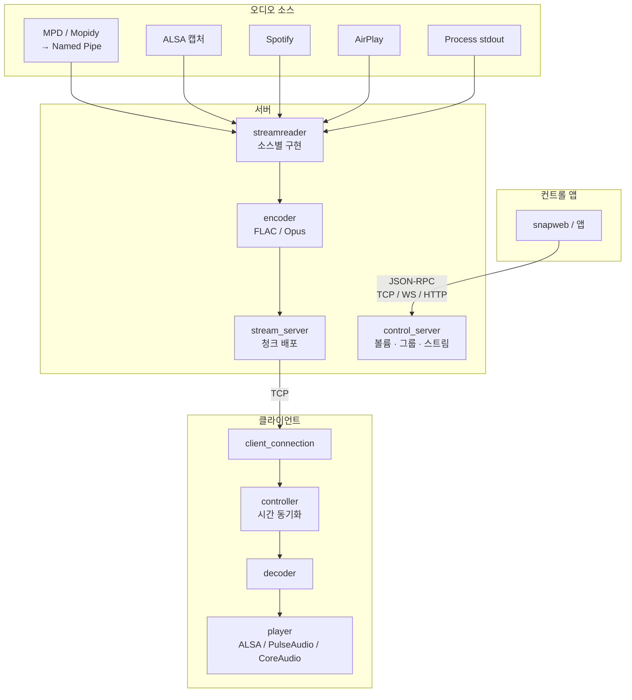

# Snapcast 코드 구조 분석

## 프로젝트 개요

Snapcast는 **멀티룸 동기 오디오 플레이어**다. 서버가 오디오 소스를 캡처해 인코딩 후 TCP로 전송하면, 여러 클라이언트가 시간 동기화를 통해 완벽하게 동시 재생한다. 전형적인 시간 편차는 **0.2ms 이하**.

- 언어: C++17
- 라이선스: GPL-3.0
- 빌드: CMake (최소 3.14)
- 버전: 0.35.0
- 코드 규모: 서버 ~8,800 LOC, 클라이언트 ~3,300 LOC, 공통 ~29,700 LOC (3rd-party 포함)

---

## 최상위 디렉토리 구조

```
snapcast/
├── server/          # Snapserver — 오디오 소스 캡처 & 스트리밍
├── client/          # Snapclient — 오디오 수신 & 재생
├── common/          # 공유 라이브러리 (메시지 프로토콜, 유틸리티)
├── control/         # 제어 스크립트 (Python)
├── doc/             # 문서 (프로토콜, API, 설정)
├── test/            # 테스트
├── cmake/           # CMake 모듈
└── extras/          # 패키징 (Debian, RPM, macOS)
```

---

## 전체 데이터 흐름



---

## 파일 목록

| 파일 | 내용 |
|------|------|
| [01_overview.md](01_overview.md) | 이 파일 — 전체 개요 및 구조 |
| [02_server.md](02_server.md) | 서버 컴포넌트 상세 분석 |
| [03_client.md](03_client.md) | 클라이언트 컴포넌트 상세 분석 |
| [04_common.md](04_common.md) | 공유 라이브러리 및 바이너리 프로토콜 |
| [05_build.md](05_build.md) | 빌드 시스템 및 의존성 |
| [06_time_sync.md](06_time_sync.md) | 시간 동기화(Time Sync) 메커니즘 상세 |
| [07_client_management.md](07_client_management.md) | 서버의 클라이언트 관리 구조 (등록·그룹·스트림 배정·영속화) |
| [08_control_stream_flow.md](08_control_stream_flow.md) | 서버-클라이언트 간 제어(JSON-RPC) 및 스트림(오디오) 전송 과정 |

### 통합(Integration) 관련 문서

| 파일 | 내용 |
|------|------|
| [../integration/android_hal.md](../integration/android_hal.md) | Android가 Snapcast 서버 역할을 수행하는 HAL 통합 설계 |
| [../integration/android_client.md](../integration/android_client.md) | Android가 Snapcast 클라이언트 역할을 수행하는 통합 검토 (기존 snapdroid 자산 분석 포함) |
