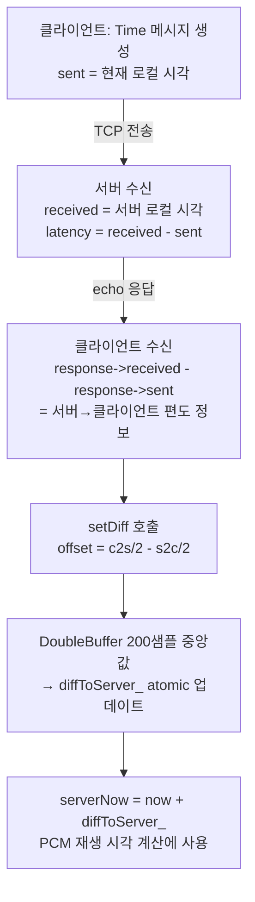
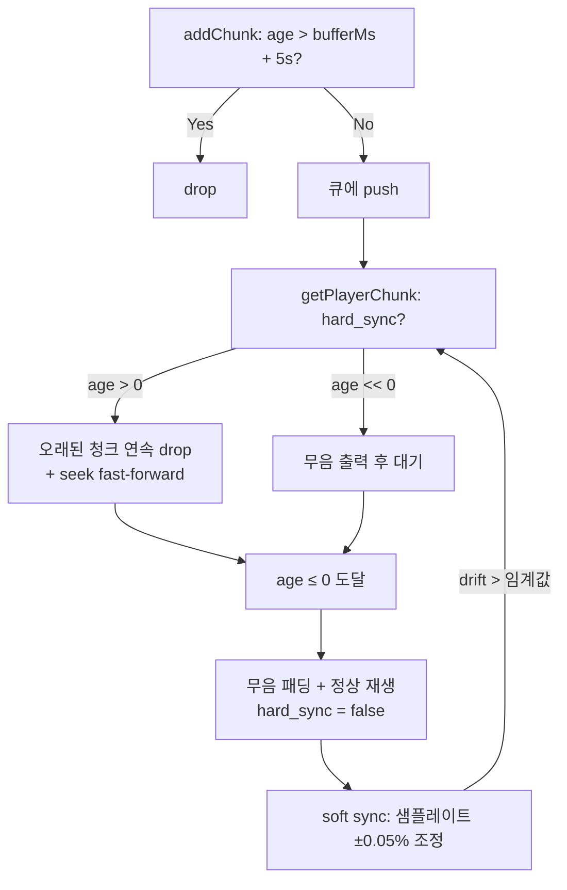

# Snapcast 시간 동기화 (Time Synchronization)

## 개요

Snapcast는 NTP와 유사한 **왕복 지연(RTT) 기반 클록 오프셋 측정** 방식을 사용한다.  
서버가 시간을 배포하는 게 아니라, **클라이언트가 능동적으로** 서버 클록 오프셋을 측정한다.  
클라이언트는 이 오프셋을 사용해 PCM 청크의 재생 시각을 서버 기준으로 맞춘다.

---

## 전체 흐름



---

## 메시지 구조

### `message_type::kTime` (4번)

[common/message/time.hpp](../../common/message/time.hpp)

```cpp
class Time : public BaseMessage
{
public:
    Time() : BaseMessage(message_type::kTime) {}

    /// The latency after round trip "client => server => client"
    tv latency;  // {int32_t sec, int32_t usec}
};
```

### `BaseMessage` 헤더 (모든 메시지 공통)

[common/message/message.hpp:172](../../common/message/message.hpp#L172)

모든 메시지의 헤더에 다음 두 타임스탬프가 내장되어 있다:

| 필드 | 크기 | 설명 |
|------|------|------|
| `tv sent` | 8B | 송신자가 보낼 때 자동 기록 |
| `tv received` | 8B | 수신자가 받을 때 자동 기록 |
| `uint16_t id` | 2B | 메시지 ID |
| `uint16_t refersTo` | 2B | 응답이 참조하는 요청 ID |

`tv` 구조체의 기본 생성자는 `steadytimeofday()`를 호출해 현재 시각을 자동으로 설정한다.

---

## 프로토콜 흐름 상세

### 1단계 — 클라이언트: Time 요청 전송

[client/controller.cpp:343](../../client/controller.cpp#L343)

```cpp
void Controller::sendTimeSyncMessage(int quick_syncs)
{
    auto timeReq = std::make_shared<msg::Time>();
    // timeReq->sent 는 BaseMessage 생성자에서 현재 로컬 시각으로 자동 설정

    clientConnection_->sendRequest<msg::Time>(timeReq, 2s, [this, quick_syncs](... response) {
        TimeProvider::getInstance().setDiff(
            response->latency,                   // c2s = 서버수신 - 클라이언트발신
            response->received - response->sent  // s2c = 클라이언트수신 - 서버발신
        );

        std::chrono::microseconds next = TIME_SYNC_INTERVAL;  // 기본 1초
        if (quick_syncs > 0)
            next = 100us;  // 초기 50회는 100μs 간격
        // 타이머로 재귀 스케줄링
    });
}
```

**동기화 주기:**
- 접속 직후 50회 × 100μs 간격 (빠른 초기 수렴)
- 이후 `TIME_SYNC_INTERVAL` (1초) 주기로 지속

### 2단계 — 서버: 수신 즉시 echo

[server/server.cpp:272](../../server/server.cpp#L272)

```cpp
if (baseMessage.type == message_type::kTime)
{
    auto timeMsg = make_shared<msg::Time>();
    timeMsg->deserialize(baseMessage, buffer);
    timeMsg->refersTo = timeMsg->id;

    // latency = 서버가 받은 시각 - 클라이언트가 보낸 시각
    //         = 클라이언트→서버 편도 전송시간 + 클록 차이
    timeMsg->latency = timeMsg->received - timeMsg->sent;

    streamSession->send(timeMsg);  // echo
}
```

서버는 **자신의 로컬 시각**으로 `received`를 기록하고, `latency = received - sent`를 계산해 그대로 돌려보낸다.

### 3단계 — 클라이언트: 오프셋 계산

[client/time_provider.cpp:36](../../client/time_provider.cpp#L36)

```cpp
void TimeProvider::setDiff(const tv& c2s, const tv& s2c)
{
    // c2s = latency          = (서버수신) - (클라이언트발신)
    //                        = RTT/2 + offset
    // s2c = received - sent  = (클라이언트수신) - (서버발신)
    //                        = RTT/2 - offset
    //
    // → offset = (c2s - s2c) / 2

    double diff = (static_cast<double>(c2s.sec)  / 2. - static_cast<double>(s2c.sec)  / 2.) * 1000.
                + (static_cast<double>(c2s.usec) / 2. - static_cast<double>(s2c.usec) / 2.) / 1000.;
    // 단위: 밀리초
    setDiffToServer(diff);
}
```

**수식 유도:**

```
c2s = RTT/2 + offset   (서버 클록이 앞서면 양수)
s2c = RTT/2 - offset

→ c2s - s2c = 2 * offset
→ offset = (c2s - s2c) / 2
```

---

## 중앙값 필터 (DoubleBuffer)

[client/time_provider.cpp:46](../../client/time_provider.cpp#L46)

```cpp
void TimeProvider::setDiffToServer(double ms)
{
    // 1분 이상 업데이트 없으면 버퍼 초기화
    if (!diffBuffer_.empty() && (diff > 60s))
    {
        diffToServer_ = static_cast<usec::rep>(ms * 1000);
        diffBuffer_.clear();
    }

    diffBuffer_.add(static_cast<usec::rep>(ms * 1000));  // μs 단위
    diffToServer_ = diffBuffer_.median();                 // 최근 200개 중앙값
}
```

[client/double_buffer.hpp](../../client/double_buffer.hpp) — `DoubleBuffer<usec::rep>`:
- 크기: **200 샘플**
- `median()`: `std::sort` 후 중간 인덱스 값 반환
- 효과: 네트워크 지연 스파이크를 제거하고 안정적인 오프셋 유지

---

## 서버 시각 사용

[client/time_provider.hpp:87](../../client/time_provider.hpp#L87)

```cpp
inline static chronos::time_point_clk serverNow()
{
    return chronos::clk::now() + getInstance().getDiffToServer<chronos::usec>();
}
```

[client/stream.cpp](../../client/stream.cpp)에서 PCM 청크의 재생 타이밍 계산에 사용:

```cpp
// 청크의 나이 = 현재 서버시각 - 청크 시작시각 - 버퍼 - DAC 시간
cs::usec age = std::chrono::duration_cast<cs::usec>(
    TimeProvider::serverNow() - chunk_->start()
) - bufferMs_.load() + outputBufferDacTime;
```

---

## 클록 타입

[common/time_defs.hpp:41](../../common/time_defs.hpp#L41)

```cpp
using clk =
#ifndef WINDOWS
    std::chrono::steady_clock;  // POSIX: 단조 증가, NTP 조정에 무관
#else
    std::chrono::system_clock;  // Windows
#endif
```

POSIX에서 `steady_clock`을 사용하므로 시스템의 NTP 보정이 측정값에 영향을 주지 않는다.

---

## 동기화 실패 시 복구 동작

딜레이가 길어 서버 시각에 맞출 수 없을 때 클라이언트는 자동으로 복구한다.  
`client/stream.cpp`의 `getPlayerChunk()`를 중심으로 3단계 대응이 동작한다.

### `age` 개념

```
age = serverNow() - 청크_시작시각 - bufferMs + DAC_레이턴시

age == 0  →  지금 딱 재생할 타이밍
age <  0  →  아직 이르다 (미래 데이터) → 무음 삽입 후 대기
age >  0  →  이미 늦었다 (과거 데이터) → 버려야 함
```

### 1단계 — 큐 입력 시 사전 필터

[client/stream.cpp:111](../../client/stream.cpp#L111)

```cpp
// addChunk()
if (age > 5s + bufferMs_)
    return;  // 조용히 drop (큐에 넣지도 않음)
```

`버퍼 설정 + 5초`보다 오래된 청크는 입력 단계에서 즉시 버린다.

### 2단계 — `hard_sync_` 모드: 빠른 재동기화

[client/stream.cpp:302](../../client/stream.cpp#L302)

`hard_sync_ = true` 상태에서:

| `age` 값 | 동작 |
|----------|------|
| `age << 0` (많이 이름) | `getSilentPlayerChunk()` — 무음 출력, 다음 콜백 대기 |
| `age > 0` (늦음) | 큐를 탐색하며 오래된 청크를 연속 drop |
| `age > 0` + 현재 청크 안에 타이밍이 있음 | `chunk_->seek(age)` — 청크 중간부터 fast-forward 재생 |
| `age ≤ 0` 도달 | 무음 패딩 삽입 후 정상 재생 시작, `hard_sync_ = false` |

```cpp
if (age.count() > 0)
{
    // 늦음: 오래된 청크를 연속 drop
    while (chunks_.try_pop(chunk_))
    {
        age = serverNow() - chunk_->start() - bufferMs_ + dacTime;
        if ((age.count() > 0) && (age < chunk_->duration<usec>()))
        {
            // 청크 중간부터 fast-forward
            chunk_->seek(age_in_frames);
            age = 0s;
        }
        if (age.count() <= 0)
            break;
    }
}
if (age.count() <= 0)
{
    // 이름: 앞부분을 무음으로 채우고 나머지 재생
    uint32_t silent_frames = frames_for(-age);
    getSilentPlayerChunk(outputBuffer, silent_frames);
    getNextPlayerChunk(outputBuffer + silent_frames, frames - silent_frames);
    hard_sync_ = false;
}
```

### 3단계 — soft sync: 샘플레이트 미세 조정

[client/stream.cpp:408](../../client/stream.cpp#L408)

hard_sync 진입 기준에 미치지 않는 작은 drift는 재생 속도 조정으로 흡수한다:

| 조건 | 동작 |
|------|------|
| `shortMedian > 100μs` (늦음) | 재생 속도 살짝 올림 (`rate < 1.0`) → 프레임 일부 drop |
| `shortMedian < -100μs` (이름) | 재생 속도 살짝 낮춤 (`rate > 1.0`) → 프레임 일부 insert |

```cpp
// 늦음: 최대 -0.05% 속도 감소
double rate = 1.0 - min((shortMedian_ / 100.) * 0.00005, 0.0005);
setRealSampleRate(format_.rate() * rate);

// 이름: 최대 +0.05% 속도 증가
double rate = 1.0 + min((-shortMedian_ / 100.) * 0.00005, 0.0005);
setRealSampleRate(format_.rate() * rate);
```

soft sync로도 감당 안 되면 아래 임계값 중 하나에서 `hard_sync_ = true`로 재진입:

```
buffer_(200샘플) 중앙값 > 2ms      → hard_sync
shortBuffer_(100샘플) 중앙값 > 5ms → hard_sync
miniBuffer_(20샘플) 중앙값 > 50ms  → hard_sync
|age| > 500ms                      → hard_sync
```

### 전체 흐름



클라이언트는 재접속 없이 자동 복구한다. 늦은 청크는 버리고 무음으로 갭을 메우면서 서버 시각으로 점프한 뒤, 이후 샘플레이트 보정으로 미세 drift를 흡수한다.

---

## 관련 파일 요약

| 파일 | 역할 |
|------|------|
| [common/message/time.hpp](../../common/message/time.hpp) | `msg::Time` 메시지 정의 |
| [common/message/message.hpp](../../common/message/message.hpp) | `BaseMessage`, `tv`, `message_type` |
| [client/time_provider.hpp](../../client/time_provider.hpp) | `TimeProvider` 싱글톤 클래스 헤더 |
| [client/time_provider.cpp](../../client/time_provider.cpp) | `setDiff()`, `setDiffToServer()` 구현 |
| [client/controller.cpp](../../client/controller.cpp) | `sendTimeSyncMessage()` — 동기화 루프 |
| [client/double_buffer.hpp](../../client/double_buffer.hpp) | 중앙값 필터 |
| [client/stream.cpp](../../client/stream.cpp) | `serverNow()` 사용 — 재생 타이밍 계산 |
| [server/server.cpp](../../server/server.cpp) | 서버 측 `kTime` 메시지 처리 및 echo |
| [common/time_defs.hpp](../../common/time_defs.hpp) | `chronos::clk`, `steadytimeofday()` |
