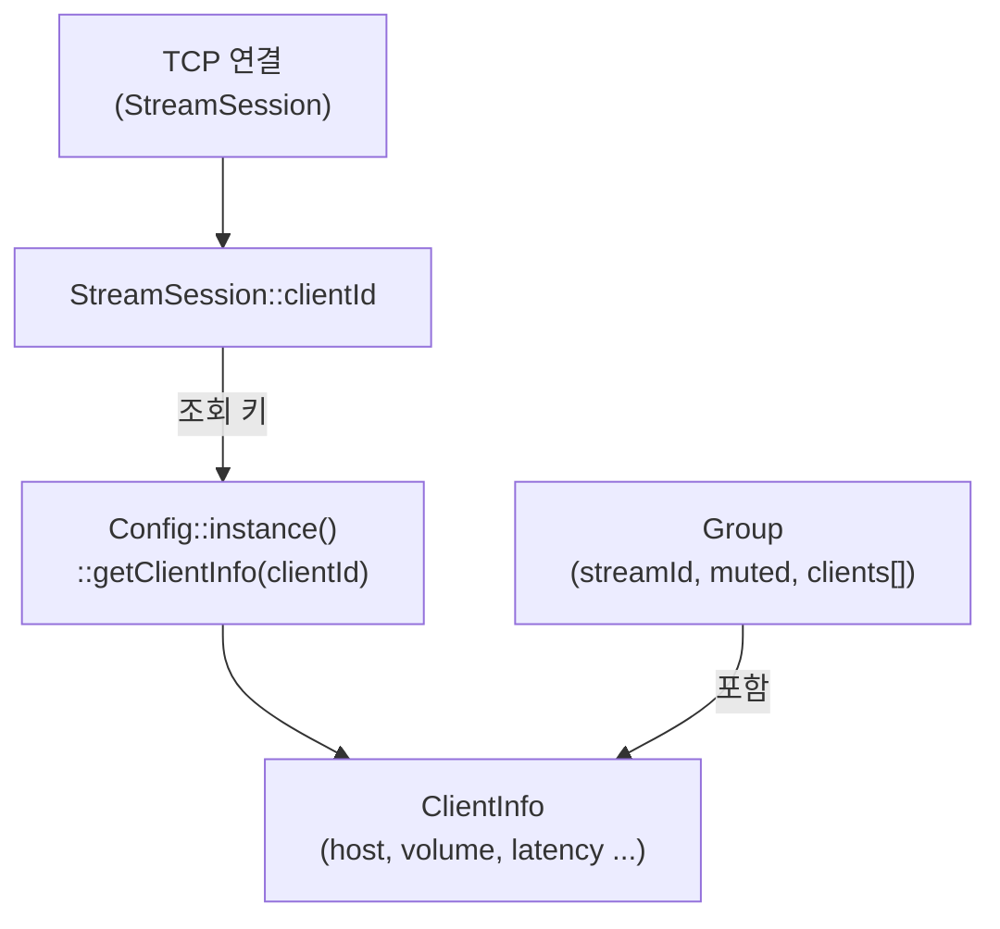
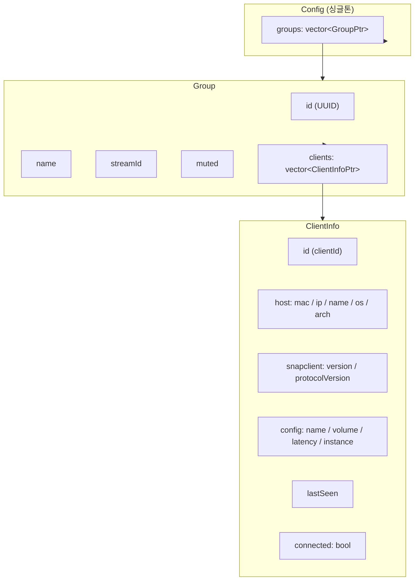
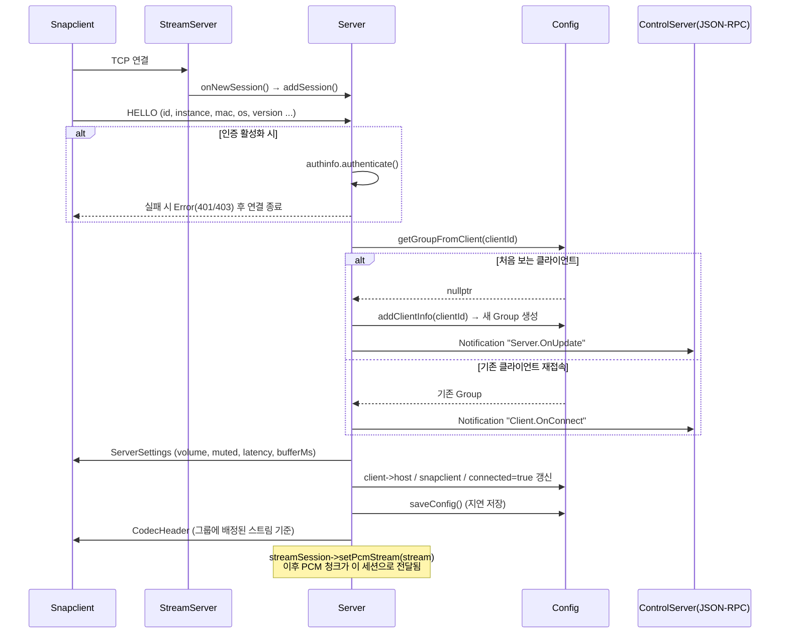
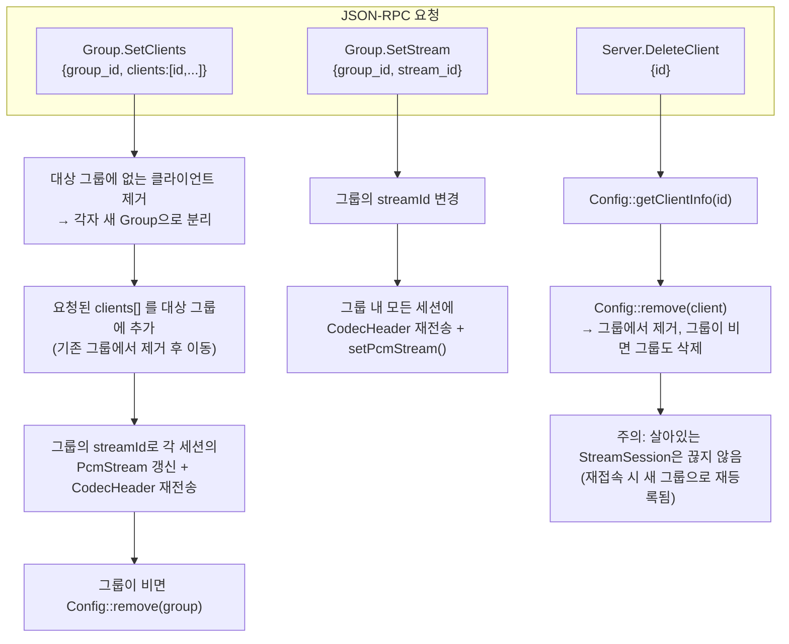
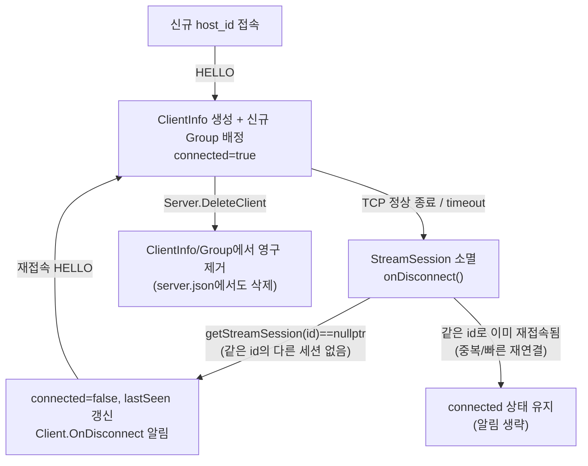

# 서버의 클라이언트 관리 구조 분석

## 역할

Snapserver는 접속한 각 Snapclient를 식별하고, 그룹(Group)으로 묶어 동일한 스트림을 배포하며, 볼륨/뮤트/레이턴시 같은 설정을 영속화한다. 이 문서는 "클라이언트가 어떻게 서버에 등록되고, 그룹/스트림에 매핑되고, 연결이 끊겼을 때 무엇이 유지되는가"를 정리한다.

---

## 핵심 개념: 연결(Session) vs 신원(ClientInfo)

Snapserver는 클라이언트의 "네트워크 연결"과 "클라이언트가 누구인지에 대한 정보"를 별도 객체로 분리해서 관리한다.

| 구분 | 클래스 | 생명주기 | 저장 위치 |
|------|--------|----------|-----------|
| 연결(런타임) | `StreamSession` ([stream_session.hpp](../../server/stream_session.hpp)) | TCP/WS 연결이 살아있는 동안만 존재 | `StreamServer::sessions_` (메모리, weak_ptr) |
| 신원(설정) | `ClientInfo` ([config.hpp](../../server/config.hpp)) | 클라이언트가 한 번이라도 접속하면 영구 보존 | `Config::groups[].clients[]` (메모리 + `server.json`) |

`StreamSession::clientId` (문자열)가 두 세계를 잇는 유일한 연결고리다. 즉 서버는 "이 TCP 소켓이 어떤 `ClientInfo`에 해당하는가"를 매 메시지마다 `clientId` 문자열로 조회한다.

---

## 클라이언트 식별자 (`clientId`)

[common/message/hello.hpp](../../common/message/hello.hpp)의 `Hello` 메시지에서 유도된다.

| 필드 | 출처 | 설명 |
|------|------|------|
| `ID` | Hello 메시지, 없으면 MAC 사용 | 클라이언트 고유 ID (보통 MAC 주소) |
| `Instance` | Hello 메시지 (기본값 1) | 동일 호스트에서 다중 Snapclient 인스턴스 구분 |
| `getUniqueId()` | `ID` + (`Instance != 1`이면 `"#" + Instance`) | 실제 `clientId`로 사용되는 최종 문자열 |

예: `00:21:6a:7d:74:fc` (인스턴스 1), `00:21:6a:7d:74:fc#2` (같은 호스트의 두 번째 인스턴스).

> [06_time_sync.md](06_time_sync.md)에서 다루는 `host_id` 개념과 동일한 식별자이며, [../integration/android_hal.md](../integration/android_hal.md)의 HAL 통합 설계에서도 이 `host_id` 기반 address 식별자를 그대로 재사용할 것을 권장하고 있다.

---

## 데이터 모델 ([server/config.hpp](../../server/config.hpp))

| 클래스 | 핵심 필드 | 비고 |
|--------|-----------|------|
| `Group` | `id`, `streamId`, `muted`, `clients[]` | 클라이언트 1개 = 그룹 1개로 시작, 여러 클라이언트를 묶을 수 있음 |
| `ClientInfo` | `id`, `host`, `snapclient`, `config`, `lastSeen`, `connected` | 접속 이력이 있는 모든 클라이언트가 여기 남는다 (접속 종료 후에도 유지) |
| `ClientConfig` | `name`, `volume`, `latency`, `instance` | 사용자가 설정 가능한 값 (JSON-RPC로 변경) |

**그룹 배정 규칙**: 클라이언트가 처음 접속하면 `Config::addClientInfo(client_id)`가 해당 클라이언트 하나만 담긴 새 `Group`을 생성한다. 이후 `Group.SetClients` RPC로 그룹을 재구성해야 여러 클라이언트가 한 그룹에 묶인다.

---

## 연결 흐름 (Hello 핸드셰이크 → 그룹/스트림 배정)

[server/server.cpp](../../server/server.cpp) `Server::onMessageReceived(StreamSession, ...)` 의 `kHello` 분기가 클라이언트 등록의 핵심이다.

핵심 포인트:
- **그룹/스트림 배정은 클라이언트 단위가 아니라 "클라이언트가 속한 그룹" 단위**로 결정된다. 새 그룹이면 기본 스트림(`streamManager_->getDefaultStream()`)이 배정된다.
- `StreamSession::setPcmStream()` 호출 이후부터 `StreamServer::onChunkEncoded()`가 배포하는 PCM 청크를 해당 세션이 수신한다 — 이 매핑이 "서버가 실제로 오디오를 누구에게 보낼지" 결정하는 지점이다.
- `TIME` 메시지 수신 시에도 `clientInfo->connected = true`와 `lastSeen`이 갱신된다 (재연결 감지용 heartbeat 역할 겸함).

---

## 그룹/스트림 관리 (JSON-RPC)

컨트롤 앱(snapweb 등)이 그룹 구성과 스트림 배정을 변경할 때의 흐름. [server/control_requests.cpp](../../server/control_requests.cpp)에 구현되어 있다.

| RPC 메서드 | 서버 측 효과 |
|------------|--------------|
| `Group.SetClients` | 그룹 멤버십 재구성. 그룹을 나간 클라이언트는 각자 단독 그룹으로 분리됨 |
| `Group.SetStream` | 그룹에 스트림 배정, 그룹 내 모든 연결된 세션에 새 코덱 헤더 전송 |
| `Group.SetMute` / `Group.SetName` | 그룹 속성만 변경 (세션에는 볼륨 알림만 전파) |
| `Client.SetVolume` | `ClientInfo.config.volume` 갱신 후 `Client.OnVolumeChanged` 알림 |
| `Client.SetLatency` | `ClientInfo.config.latency` 갱신 (재생 타이밍 보정, [06_time_sync.md](06_time_sync.md) 참고) |
| `Client.SetName` | 사용자 지정 표시 이름 저장 |
| `Server.DeleteClient` | `ClientInfo`를 그룹에서 영구 삭제 (연결 자체를 끊지는 않음) |

---

## 클라이언트 라이프사이클 상태

- **재접속해도 설정은 유지된다**: `ClientInfo`는 그룹에 남아있으므로 볼륨·레이턴시·그룹 배정이 재접속 시 그대로 복원된다.
- **중복 접속 처리**: 동일 `clientId`로 새 세션이 붙어도 기존 세션을 강제로 끊는 로직은 없다 — `onDisconnect()`에서 `getStreamSession(clientId)`가 여전히 유효하면(다른 세션이 이미 연결됨) `Client.OnDisconnect` 알림을 생략한다 ([server/server.cpp:120](../../server/server.cpp#L120)).
- **삭제와 연결 해제는 별개**: `Server.DeleteClient`는 설정(`ClientInfo`)만 제거하며, 살아있는 TCP 연결을 끊지는 않는다. 클라이언트가 계속 `TIME`/`HELLO`를 보내면 새 `ClientInfo`가 다시 생성된다.

---

## 영속화 (`server.json`)

- 그룹/클라이언트 트리는 `Config::save()` ([server/config.cpp:120](../../server/config.cpp#L120))가 JSON으로 직렬화해 `~/.config/snapserver/server.json` (또는 `--server.datadir`)에 저장한다.
- `Server::saveConfig()` ([server/server.cpp:430](../../server/server.cpp#L430))는 이벤트마다 즉시 쓰지 않고 짧은 지연(`deferred`, 기본 2초) 후 저장하는 디바운스 방식으로 디스크 I/O를 줄인다.
- 서버 재시작 시 `Config::init()` ([server/config.cpp:45](../../server/config.cpp#L45))이 이 파일을 읽어 그룹/클라이언트 목록을 복원한다 — 클라이언트가 재접속하기 전에도 마지막 상태(이름, 볼륨, 그룹 구성)가 컨트롤 API에 노출된다.

---

## 관련 파일 요약

| 파일 | 역할 |
|------|------|
| [server/config.hpp](../../server/config.hpp) / [.cpp](../../server/config.cpp) | `ClientInfo`, `Group`, `Config` 정의 및 그룹/클라이언트 CRUD |
| [server/server.cpp](../../server/server.cpp) | `kHello` 처리 — 클라이언트 등록, 그룹/스트림 배정, 연결 해제 알림 |
| [server/stream_server.hpp](../../server/stream_server.hpp) / [.cpp](../../server/stream_server.cpp) | `StreamSession` 목록 관리, `clientId` 기준 세션 조회 |
| [server/stream_session.hpp](../../server/stream_session.hpp) | 연결 단위 상태 (`clientId`, `pcm_stream_`, 인증 정보) |
| [server/control_requests.cpp](../../server/control_requests.cpp) | `Group.SetClients`, `Group.SetStream`, `Server.DeleteClient` 등 관리 RPC |
| [common/message/hello.hpp](../../common/message/hello.hpp) | `getUniqueId()` — `clientId` 생성 규칙 (MAC + instance) |
| [06_time_sync.md](06_time_sync.md) | 클라이언트별 시각 동기화 (레이턴시 설정과 연계) |
| [../integration/android_hal.md](../integration/android_hal.md) | `host_id`를 그룹/스트림 단위 HAL 디바이스 식별자로 재사용하는 설계 |
