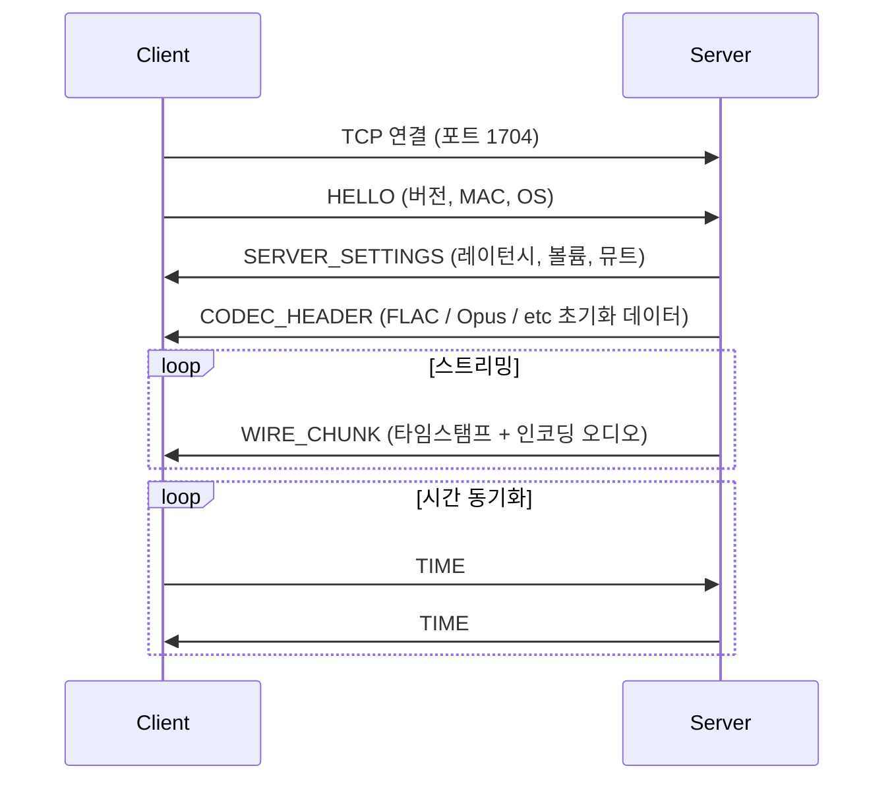
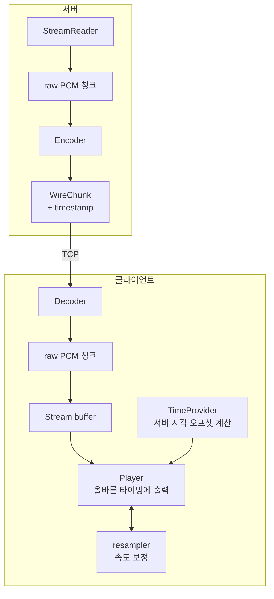
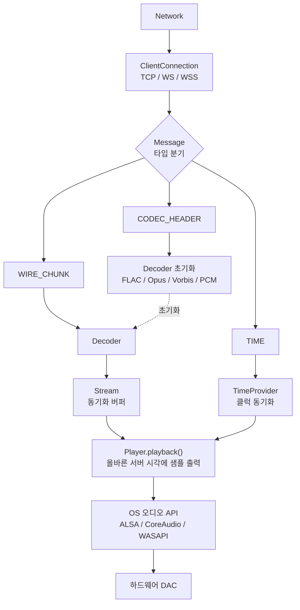

# 서버-클라이언트 제어 및 스트림 전송 흐름

## 개요

Snapserver와 Snapclient는 두 개의 독립적인 TCP 채널로 통신한다.

| 채널 | 기본 포트 | 프로토콜 | 용도 |
|------|-----------|---------|------|
| 스트림 | 1704 | TCP / WebSocket | 오디오 청크 배포 (바이너리 프로토콜) |
| 컨트롤 | 1705 / 1780 / 1788 | TCP / HTTP / WebSocket(SSL) | JSON-RPC 관리 API |

자세한 내용은 아래 문서를 참고한다.

- 서버 측 구현: [03_server.md](03_server.md)
- 클라이언트 측 연결 구현: [04_client.md](04_client.md)
- 메시지 타입 / 바이너리 헤더 정의: [05_common.md](05_common.md)

---

## 1. 연결 수립 (핸드셰이크)

클라이언트가 스트림 포트(1704)에 접속한 직후의 초기 교환 순서다.

서버는 HELLO를 받으면 내부적으로 다음 작업을 한다.

- 클라이언트 등록
- 그룹 / 스트림 배정
- 인증 처리

이 흐름의 자세한 내용은 [07_client_management.md](07_client_management.md#연결-흐름-hello-핸드셰이크--그룹스트림-배정)에서 다룬다.

---

## 2. 오디오 스트림 전송 (스트림 채널)

### 2.1 서버 → 클라이언트 PCM 처리 흐름

### 2.2 클라이언트 수신 메시지 처리 (message dispatch)

클라이언트가 스트림 소켓에서 메시지를 받으면, 메시지 타입마다 서로 다른 컴포넌트로 전달된다.
아래 다이어그램은 그 라우팅 경로를 보여준다.

클라이언트는 TIME 메시지로 서버와의 클럭 오프셋을 계산하고, 재생 타이밍을 보정한다.

- 상세 수식과 구현은 [06_time_sync.md](06_time_sync.md)에서 다룬다.

---

## 3. 제어 채널 (JSON-RPC)

제어 API는 다음 방식으로 제공된다.

- 채널: TCP 포트 1705 / HTTP 1780 / WebSocket
- 구현: [server/control_requests.cpp](../../server/control_requests.cpp)

### 주요 RPC 메서드

| 메서드 | 방향 | 설명 |
|--------|------|------|
| `Server.GetStatus` | 요청 | 전체 서버 상태 조회 |
| `Server.GetRPCVersion` | 요청 | API 버전 조회 |
| `Server.DeleteClient` | 요청 | 클라이언트 제거 |
| `Client.GetStatus` | 요청 | 클라이언트 상태 조회 |
| `Client.SetVolume` | 요청 | 볼륨 / 뮤트 설정 |
| `Client.SetLatency` | 요청 | 클라이언트 레이턴시 조정 |
| `Client.SetName` | 요청 | 클라이언트 이름 설정 |
| `Group.GetStatus` | 요청 | 그룹 상태 조회 |
| `Group.SetClients` | 요청 | 그룹 멤버 변경 |
| `Group.SetStream` | 요청 | 그룹에 스트림 할당 |
| `Group.SetMute` | 요청 | 그룹 뮤트 설정 |
| `Stream.GetStatus` | 요청 | 스트림 상태 조회 |
| `Stream.SetProperty` | 요청 | 스트림 속성 설정 |
| `Stream.Control` | 요청 | 재생/일시정지/다음 트랙 |

다음 RPC를 호출하면 서버 내부에서 세션/설정이 갱신된다.

- `Group.SetClients`
- `Group.SetStream`
- `Server.DeleteClient`

실제로 무엇이 갱신되는지는 [07_client_management.md](07_client_management.md#그룹스트림-관리-json-rpc)에 상세 시퀀스로 정리되어 있다.

### 인증

- **Basic Auth**: Base64 인코딩 ([base64.h](../../common/base64.h))
- **JWT 토큰**: [jwt.cpp](../../server/jwt.cpp) — HS256 서명

---

## 관련 파일 요약

| 파일 | 역할 |
|------|------|
| [server/stream_server.cpp](../../server/stream_server.cpp) | 스트림 포트 연결 수락, PCM 청크 배포 |
| [server/control_server.cpp](../../server/control_server.cpp) | JSON-RPC 서버 (TCP/HTTP/WS) |
| [server/control_requests.cpp](../../server/control_requests.cpp) | RPC 요청 핸들러 |
| [client/client_connection.hpp](../../client/client_connection.hpp) | 서버 연결 추상화 (TCP/WS/WSS) |
| [client/controller.cpp](../../client/controller.cpp) | 메시지 타입 분기, 시간 동기화 루프 |
| [common/message/](../../common/message/) | 바이너리 메시지 정의 (Hello, ServerSettings, CodecHeader, WireChunk, Time 등) |

## 관련 문서

| 파일 | 내용 |
|------|------|
| [03_server.md](03_server.md) | 서버 컴포넌트 상세 (스트림 서버, 컨트롤 서버) |
| [04_client.md](04_client.md) | 클라이언트 컴포넌트 상세 (연결, 디코더, 플레이어) |
| [05_common.md](05_common.md) | 메시지 타입 정의 및 바이너리 헤더 구조 |
| [06_time_sync.md](06_time_sync.md) | 시간 동기화 메커니즘 상세 |
| [07_client_management.md](07_client_management.md) | 클라이언트 등록·그룹·스트림 배정·영속화 |
